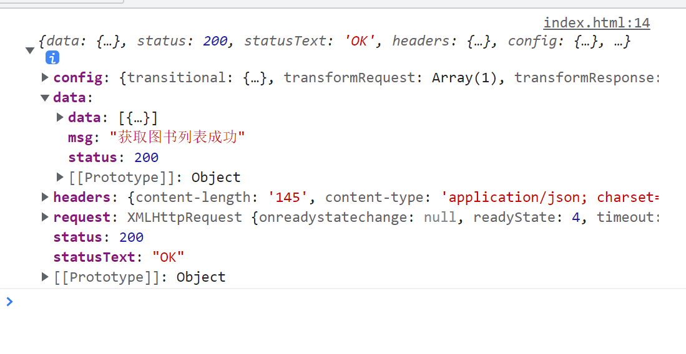
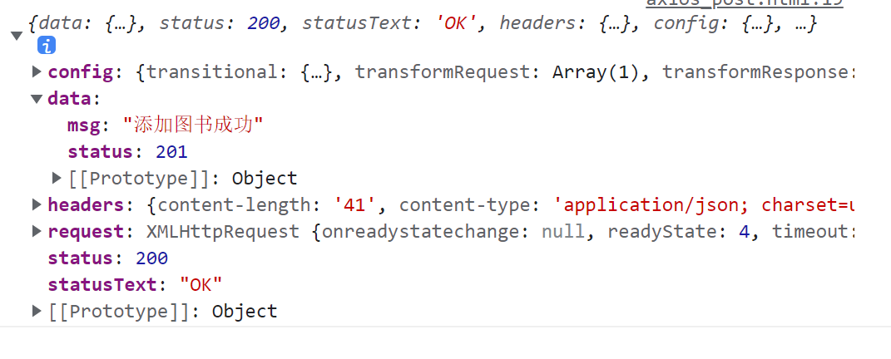

# Axios

axios 是专注于网络请求的库

相比于原生的 XMLHttpRequest 对象, axios 简单易用

相比于 jQuery, axios 更加轻量化, 只专注于网络数据请求

# axios 发起GET请求

axios发起get请求的语法:

`axios.get("url",{params:{参数}}).then(callback)`

```js
            let url = "http://www.liulongbin.top:3006/api/getbooks";
            axios.get(url, { params: { id: 1 } }).then(function (e) {
                console.log(e);
            });
```

​

# axios发起post请求

`axios.post("url",{参数}).then(callback);`

‍

```js
            let url = "http://www.liulongbin.top:3006/api/addbook";
            let obj = {
                bookname: "Mybook",
                author: "xxx",
                publisher: "xxx publisher",
            };
            axios.post(url, obj).then(function (e) {
                console.log(e);
            });
```

​

# 直接使用axios发送请求

axios也提供了类似于jQuery中$.ajax()的函数, 语法如下

```js
axios({
	method: "请求类型",
	url:"请求url",
	data: {post数据},
	params: {get参数}
}).then(callback);

```
