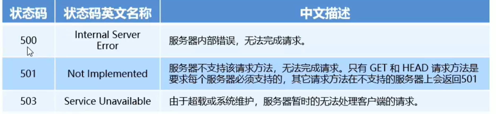

# HTTP协议

# 通信

## 什么是通信

通信, 就是信息的传递和交换

‍

通信三要素:

* 通信的主体
* 通信的内容
* 通信的方式

‍

## 什么是通信协议

通信协议(Communication Protocol) 是指通信的双方完成通信所必须遵守的规则和约定

通俗来说: 通信双方采用约定好的格式来发送和接收消息, 这种实现约定好的通信格式, 就叫做通信协议

‍

客户端与服务器之间要实现网页内容的传输, 则通信的双方必须遵守网页内容的传输协议

网页内容叫做超文本, 因此网页内容的传输协议又叫做超文本传输协议(HyperText Transfer Protocol), 简称 HTTP 协议

# HTTP

## 什么是 HTTP 协议

HTTP 协议即超文本传输协议, 它规定了客户端与服务器之间进行王爷传输时所必须遵守的传输格式

例如:

* 客户端要以 HTTP 协议要求的格式吧数据提交到服务器
* 服务器要以 HTTP 协议要求的格式把内容响应给客户端

## HTTP 协议的交互模型

HTTP 协议采用了 ==请求/响应== 的交互模型

‍

## HTTP 协议的请求消息

由于 HTTP 协议属于客户端浏览器和服务器之间的通信协议, 因此, 客户端发起的请求叫做 ==HTTP 请求==, 客户端发送到服务器的消息, 叫做 ==HTTP 请求消息==

‍

注意: HTTP 的请求消息又叫做 HTTP 的==请求报文==

### HTTP 请求消息的组成部分

HTTP 请求消息由==请求行==(request line), ==请求头部==(header), ==空行==和==请求体== 4 部分组成

​

#### 1.请求行

请求行由 ==请求方式==, ==url== 和 ==HTTP 协议版本== 3 个部分组成, 他们之间用空格隔开

​

​

‍

#### 2.请求头部

请求头部用来描述客户端的基本信息, 从而把客户端相关的信息告知服务器, 比如: `User-Agent` 用来说明当前是什么类型的浏览器, `Content-Typ` e 用来描述发送到服务器的数据格式, `Accept` 用来描述客户端能够接受什么类型的返回内容,  `Accept-Language ​` 用来描述客户端期望接受哪种语言的文本内容

请求头部由多行 键值对 组成, 每行的键和值之间用冒号分隔

​

​

#### 3.空行

最后一个请求头字段的后面是一个空行, 通知服务器请求头部至此结束

请求消息中的空行, 用来分隔请求头部和请求体

​

#### 4.请求体

请求体中存放的, 是要通过 POST 方式提交到服务器的数据

==注意: 只有 POST 请求才有请求体==

‍

‍

‍

## HTTP 协议的响应消息

响应消息就是服务器响应给客户端的消息内容, 也叫做响应报文

### HTTP 响应消息的组成部分

HTTP 响应消息由状态行, 响应头部, 空行 和 响应体 四个部分组成

​

#### 1.状态行

状态行由 ==HTTP 协议版本==, ==状态码== 和 ==状态码的描述==文本 三个部分组成, 它们之间使用空格隔开

​

‍

#### 2.响应头部

响应头部是用来描述服务器的基本信息, 响应头部是由多行 键值对 组成, 每行的键和值之间用冒号分隔

​

#### 3.空行

在最后一个响应头部结束治藏, 会紧跟一个空行, 用来通知客户端响应头至此结束

响应消息中的空行, 用来分隔响应头部和响应体​

#### 4.响应体

响应体中存放的, 是服务器响应给客户端的资源内容

‍

## HTTP 请求方法

HTTP 请求方法, 是属于 HTTP 协议中的一部分, 请求方法的作用是, 用来表明要对服务器上的资源进行的操作

‍

最常用的请求方法是 GET 和 POST

​

‍

## HTTP 响应状态码

HTTP 响应状态码 (HTTP Status Code) 也属于 HTTP 协议的一部分, 用来标识相应的状态

响应状态码会随着响应消息一起被发送至客户端浏览器, 浏览器根据服务器返回的响应状态码, 就能知道这次 HTTP 请求的结果是成功还是失败了

### HTTP 响应状态码的组成和分类

HTTP 响应状态码由三位十进制数字组成, 第一个十进制数字定义了状态码的类型, 后两个数字用来对状态码进行细分

HTTP 响应状态码分为 5 种类型

​

#### 200 系列成功状态码

200系列的状态码, 表示服务器已成功接收到请求并进行处理,

​

#### 300 系列重定向状态码

300系列的状态码, 表示服务器需要客户端重定向, 需要客户端进一步的操作以完成资源的请求​

#### 400系列客户端错误状态码

400系列状态码, 表示客户端的请求中有非法内容, 从而导致请求失败

​

#### 500系列服务端错误状态码

500系列状态码, 表示服务器未能正确处理客户端的请求而出现意外错误.

​
