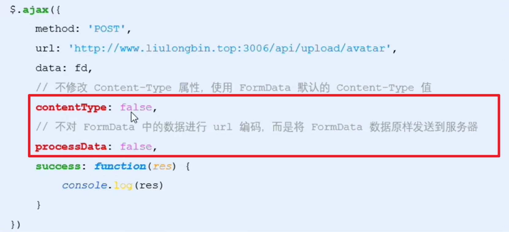
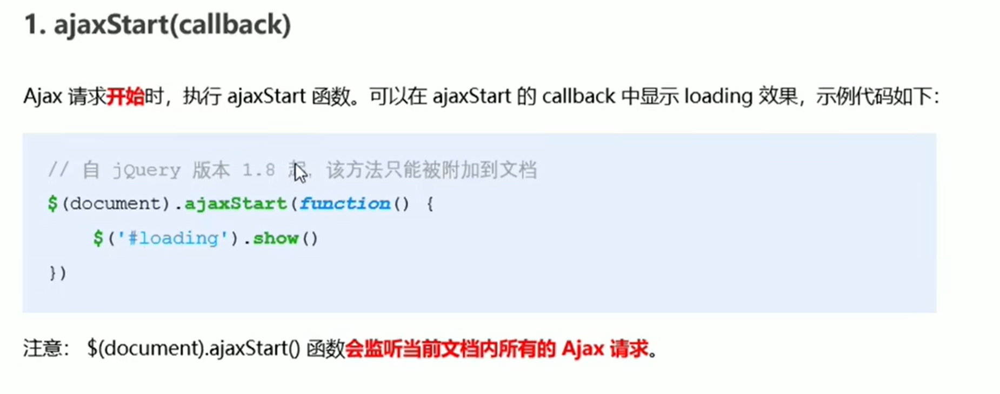
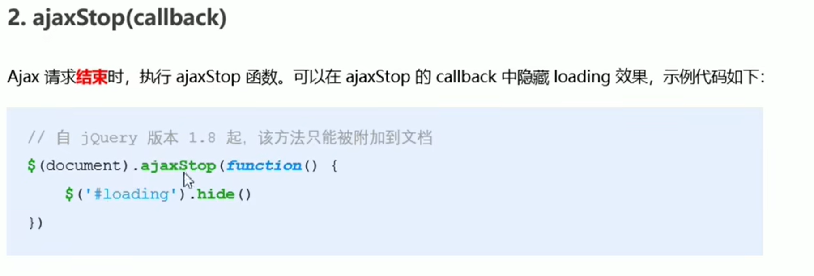

# XMLHttpRequest level 2

# 旧版 xhr 的缺点

* 只支持文本数据的传输, 无法用来读取和上传文件
* 传送和接收数据的时候, 没有进度信息, 只能提示有没有完成

# xhr Level2 的新功能

* 可以设置 HTTP 请求的时限
* 可以使用 FormData 对象管理表单数据
* 可以上传文件
* 可以获取数据传输的进度信息

# 设置 HTTP 请求时限

有时, Ajax 操作很耗时, 而且无法预知要花多少时间, 如果网速很慢, 用户可能要等很久, 新版本的 xhr 对象, 增加了 timeout 属性, 可以设置 HTTP 请求的时限

`xhr.timeout = 3000;` //单位毫秒

过了 timeout 时限之后, 就会自动停止 HTTP 请求, 与之配套的还有 timeout 事件, 用来指定回调函数

‍

```js
            let xhr = new XMLHttpRequest();
            xhr.addEventListener("timeout", function () {
                console.log("请求超时!");
            });
```

‍

‍

# FormData 对象管理表单数据

Ajax 操作往往用来提交表单数据, 为了方便表单处理, HTML5 新增了一个 FormData 对象, 可以模拟表单操作

## 创建 FormData 对象

`let fd = new FormData();`

## 使用 append() 函数向 FormData 追加数据

`fd.append("name","tim");`

## 获取 form 表单的数据

先获取 form 表单

`let form = document.querySelector("#form");`

初始化 FormData

`let fd = new FormData(form);`

使用 xhr 的 send 函数发送 fd

`xhr.send(fd);`

完整代码如下

```js
 let form = document.querySelector("#form");
            form.addEventListener("submit", function (e) {
                e.preventDefault();
                let xhr = new XMLHttpRequest();
              

                xhr.open("post", "http://www.liulongbin.top:3006/api/formdata");
                xhr.setRequestHeader(
                    "Content-Type",
                    "application/x-www-form-urlencoded"
                );
                xhr.send(fd);
                xhr.addEventListener("readystatechange", function () {
                    if (xhr.readyState == 4) {
                        console.log(JSON.parse(xhr.responseText));
                    }
                });
                xhr.addEventListener("timeout", function () {
                    console.log("请求超时!");
                });
            });
```

# 文件上传

实现步骤

1. 定义 ui 结构
2. 验证是否选择了文件
3. 向 FormData 追加文件
4. 使用 xhr 发起上传文件的请求
5. 监听 onreadystatechange 事件

## 验证是否选择了文件

`input ​` 标签下的 `files ​` 属性就是选择的文件, 验证他的 `length ​` 属性即可判断是否选择了文件

‍

```js
            let btn = document.querySelector("button");
            let ipt_file = document.querySelector("#file");
            btn.addEventListener("click", function (e) {
                e.preventDefault();
                if (ipt_file.files.length<=0) {
                    return alert("请选择文件!")

                }else{
                    //后续逻辑
                }

            });
```

## 向 FormData 中追加文件

`fd.append("avatar",data);`

‍

## 上传文件完整代码如下

‍

```js
<script>
            let btn = document.querySelector("button");
            let ipt_file = document.querySelector("#file");
            let img = document.querySelector("img");
            btn.addEventListener("click", function (e) {
                e.preventDefault();
                let files = ipt_file.files;
                if (files.length <= 0) {
                    return alert("请选择文件!");
                } else {
                    //后续逻辑
                    let fd = new FormData();
                    fd.append("avatar", files[0]);

                    let xhr = new XMLHttpRequest();
                    xhr.open(
                        "post",
                        "http://www.liulongbin.top:3006/api/upload/avatar"
                    );
                    xhr.send(fd);
                    xhr.addEventListener("readystatechange", function () {
                        if (xhr.readyState == 4 && xhr.status == 200) {
                            let data = JSON.parse(xhr.responseText);
                            if (data.status !== 200) {
                                console.log("上传出错!" + data.message);
                            } else {
                                console.log("上传成功" + data.message);
                                console.log(data);
                                img.src =
                                    "http://www.liulongbin.top:3006" + data.url;
                            }
                        }
                    });
                }
            });
        </script>
```

‍

## 显示文件上传进度

新版本的 `XMLHttpRequest` 对象中, 可以通过监听 `xhr.upload.onprogress` 事件, 来获取文件的上传进度

`onprogress` 的事件对象:

* e.lengthComputable: 布尔值, 当前上传的资源是否具有可计算的长度
* e.loaded 以传输的字节
* e.total 需传输的字节

‍

```js

                    let xhr = new XMLHttpRequest();
                    xhr.upload.addEventListener("progress", function (e) {
                        if (e.lengthComputable) {
                            let progress = Math.ceil(
                                (e.loaded / e.total) * 100
                            );
                            console.log("uploading... " + progress + "%");
                        }
                    });
```

### 文件上传完成事件

`xhr.upload.onload`

‍

```js
                    //文件上传完成事件
                    xhr.upload.addEventListener("load",function () {
                        progressBar.className="progress-bar progress-bar-success";
                    })
```

‍

### jQuery 实现文件上传

​

​

​
