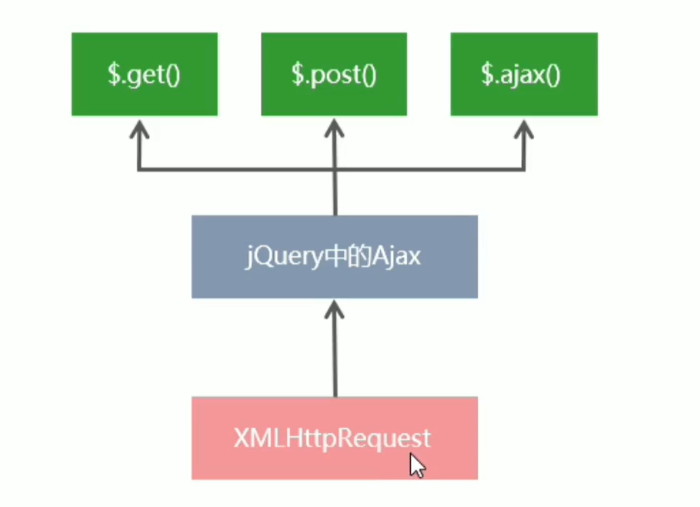

# XMLHttpRequest的基本使用

# 什么是XMLHttpRequest

XMLHttpRequest 简称xhr, 是浏览器提供的 JavaScript 对象, 通过它可以请求服务器上的数据资源, jQuery中的Ajax函数, 就是基于xhr封装出来的

​

‍

# 使用xhr发起get请求

步骤

1. 创建xhr对象
2. 调用xhr.open()函数
3. 调用xhr.send()函数
4. 监听 xhr.onreadystatechange事件

```js
        <script>
            //创建xhr对象
            let xhr = new XMLHttpRequest();
            // 调用open函数
            xhr.open("get", "http://www.liulongbin.top:3006/api/news");
            // 调用send函数
            xhr.send();
            // 监听readystatuschange事件
            xhr.addEventListener("readystatechange", function (e) {
                if (xhr.readyState == 4 && xhr.status == 200) {
                    console.log(xhr.readyState);
                    console.log(xhr.status);
                    console.log(xhr.responseText);
                }
            });
        </script>
```

## xhr对象的readyState属性

XMLHttpRequest对象的readystate属性 , 用来表示当前Ajax请求所处的状态, 

每个Ajax请求必然处于以下状态的一个

|值|状态|描述|
| ----| -------------------| ------------------------------------------------|
|0|unsent|xhr对象已创建, 但尚未调用open方法|
|1|opened|open()方法已经调用|
|2|headers_receieved|send()方法已经被调用, 响应头已经被接收|
|3|loading|数据接收中, 此时response属性中已经包含部分数据|
|4|done|Ajax请求完成, 这意味着数据传输已经彻底==完成==或者==失败==|

## 使用xhr发起带参数的get请求

使用xhr对象发起带参数的get请求时,只需要在调用open()期间, 为url指定参数即可

```js
xhr.open("get", "http://www.liulongbin.top:3006/api/getbooks?id=1");
```

这种在url地址后面拼接的参数, 叫做==查询字符串==

# 查询字符串

查询字符串(url参数)是指在url的末尾加上用于向服务器发送信息的字符串(变量)

格式: 

将英文的`?` 放在url的末尾, 然后加上 `参数=值` , 像加上多个参数的话, 就用`&`进行分隔

`http://www.liulongbin.top:3006/api/getbooks?id=1`

## get请求携带参数的本质

无论使用`$.ajax`, 还是使用`$.get` 又或者直接使用xhr对象发起get请求, 当需要携带参数的时候,  ==本质上, 都是直接将参数以查询字符串的形式, 追加到url地址的后面==

‍

# url编码与解码

url地址中, 只允许出现英文相关的字母, 标点符号, 数字, 因此, 在url地址中不允许出现中文

如果url中需要包含中文这样的字符, 则需要对中文编码进行==编码==(转义)

url编码的原则, 使用安全的字符(没有特殊用途或特殊意义的可打印字符)去表示那些不安全的字符

简单理解: 使用英文字符表示非英文字符

## 如何对url进行编码与解码

浏览器提供了url编码与解码的api

* encodeURL() url编码
* decodeURL() url解码

​

‍

‍

由于浏览器会自动对url进行编码操作, 因此, 大多数情况下, 程序员不需要关心url地址的编码与解码操作

‍

# 使用xhr发起post请求

步骤:

1. 创建xhr对象
2. 调用xhr.open() 函数
3. ==设置content-type属性 (固定写法)==
4. 调用xhr.send() 函数, ==同时指定要发送的数据==
5. 监听xhr.onreadystatechange事件

‍

```js
        <script>
            let res;
            //创建xhr对象
            let xhr = new XMLHttpRequest();
            // 调用open函数
            xhr.open("post", "http://www.liulongbin.top:3006/api/addbook");
            // 设置Content-Type
            xhr.setRequestHeader("Content-Type","application/x-www-form-urlencoded")
            // 调用send函数
            xhr.send("bookname=得到&author=得adaw&publisher=dawdawdawd");
            // 监听readystatuschange事件
            xhr.addEventListener("readystatechange", function (e) {
                if (xhr.readyState == 4 && xhr.status == 200) {
                    res = xhr.responseText;
                    console.log(res);
                    let resObj=JSON.parse(res);
                    console.log(resObj);
                }
            });
        </script>
```

‍
