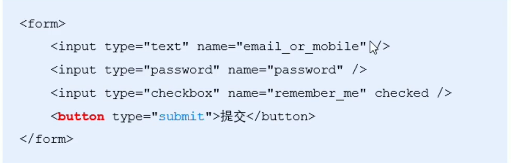

# form表单的基本使用

## 什么是表单

表单在网页中主要负责==数据采集==的功能, html中的`<form>`标签, 就是用于采集用户输入的信息, 并通过`<form>`标签的提交操作,把采集到的信息提交到服务器进行处理 

## 表单的组成部分​

表单由三个部分组成:

* 表单标签
* 表单域: 文本框 密码框 隐藏域 多行文本框 复选框单选框 下拉选择 文件上传
* 表单按钮

‍

## <form>标签的属性

`form ​`标签用来采集数据, `form`标签的属性则是用来规定如何把采集到的数据发送到服务器

|属性|值|描述|
| ---------| --------------------------------------------------------------------| -------------------------------------|
|action|url地址|当提交表单时, 向何处发送表单数据|
|method|get 或 post|采用何种方式将数据发送到 action url|
|enctype|application/x-www-form-urlencoded multipart/form-data text/plain|规定在发送数据之前如何对其进行编码|
|target|_blank _self _parent _top _framename|规定在何处打开 action url|

### action

* `action ​`属性用来规定当提交表单时, 向何处发送表单数据
* `action ​`属性的值应该是后端提供的url地址, 这个url地址专门用来接受表单提交过来的数据
* 当`form`表单未指定`action`属性值的情况下, `action`的默认值为当前页面的 url 地址

==注意: 提交表单后, 页面会立刻跳转到 action指定的 url 地址==

### target

target 属性用来规定在何处打开 action url 

他的可选值有五个, 默认情况下, target的值是_self , 表示在相同的框架中打开 action url

|值|描述|
| -----------| --------------------------|
|_blank|在新窗口中打开|
|_self|默认, 在相同的框架中打开|
|_parent|在父框架集中打开 |
|_top|在整个窗口中打开|
|_framname|在指定框架中打开|

### method

method 属性用来规定用何种方式把表单数据提交到 action url

他的可选值有两个 分别是get和post

默认情况下, method的值为get

‍

注意: 

‍

*  get方式适合用来提交少量的, 简单的数据.
* post方法适合用来提交大量的, 复杂的, 或包含文件上传的数据

实际开发中, <form>表单的post提交方式用的最多, 很少用get, 例如登录 注册, 添加数据等表单操作, 都需要使用post方法来提交表单

‍

### 

### enctype

enctype 属性用来规定在发送表单数据之前如何对数据进行编码

他的可选值有三个, 默认值为application/x-www-form-urlencoded, 表示在编码前编码所有字符

|值|描述|
| -----------------------------------| -----------------------------------------|
|application/x-www-form-urlencoded|在发送前编码所有字符 默认值|
|multipart/form-data|==不对字符编码, 在使用包含文件上传控件的表单时, 必须使用该值==|
|text/plain|空格转换为+, 但不对特殊字符编码, 很少用|

‍

## 表单的同步提交及其缺点

通过点击submit按钮, 触发表单提交的操作, 从而使页面跳转到action url 的行为. 就叫做表单的同步提交

### 表单同步提交的缺点

* form 表单同步提交后, 整个页面会发生跳转, 跳转到 action url 所指定的地址, 用户体验很差
* form 表单同步提交后, 页面之前的状态和数据会消失

解决方案: 表单只负责采集数据, Ajax负责将数据提交到服务器
