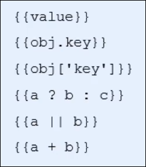

# 模板引擎

# 什么是模板引擎

模板引擎顾名思义， 就是可以根据程序员指定的模板结构和数据， 自动生成一个完整的html页面

# 模板引擎的好处

* 减少了字符串的拼接操作
* 使代码结构更清晰
* 使代码更易于阅读与维护

# art-template 模板引擎的使用

1. 导入 art-template
2. 定义数据
3. 定义模板
4. 调用template函数
5. 渲染html结构

‍

```js
    <body>
        <script type="text/html" id="tpl">
            <h1>{{name}}</h1>
            <h2>{{age}}</h2>
        </script>
        <script>
            let data = { name: "tim", age: 18 };
            let html = template("tpl", data);
            document.body.insertAdjacentHTML("beforeend", html);
        </script>
    </body>
```

==注意: 传入一个对象, 输出里面的属性==

‍

# art-template标准语法

什么是标准语法

art-template 提供了`{{}}`这种语法格式， 在{{}}中可以进行变量输出， 或循环数组等操作， 这种

## 标准语法： 输出

​

在`{{}}`语法中， 可以进行==变量==的输出， ==对象属性==的输出， ==三元表达式==的输出， ==逻辑或==输出， ==加减乘除等表达式==输出

‍

## 标准语法： 原文输出

`{{ @ value}}`

如果要输出的value值中， 包含了html标签结构， 则需要使用原文输出语法，才能保证html标签被正常渲染

‍

## 标准语法： 条件输出

如果要实现条件输出， 可以在{{}}中使用if， else if 的方式， 实现按需输出

```js
{{if value}} 按需输出的内容 {{/if}}
{{if value}} 按需输出的内容 {{else if val2}} 按需输出的内容 {{/if}}
```

‍

## 标准语法： 循环输出

如果要实现循环输出， 则可以在{{}}内， 通过each方法循环数组， 当前循环的索引使用`$index`来访问， 当前循环项使用`​ $value`来访问

```js
{{each arr}}
{{$index}}{{$value}}
{{/each}}
```

‍

## 标准语法: 过滤器

`{{value | filterName}}`

过滤器语法类似于管道操作符, 他的上一个输入作为下一个输出

定义过滤器的基本语法如下:

`templare.defaults.imports.filterName=function(value){处理函数}`

‍

# 模板引擎的实现原理

## 正则和字符串操作[^1]

‍

‍

# 模板引擎的实现

‍

```js
function template(id, data) {
    let str = document.getElementById(id).innerHTML;
    let regExp = /{{\s*([a-zA-Z]+)\s*}}/;
    let res = null;
    while ((res = regExp.exec(str))) {
        str = str.replace(res[0], data[res[1]]);
        console.log(res);
    }
    return str; //返回处理好的字符串
}
```

[^1]: # 正则和字符串操作

    # exec()函数

    exec() 函数用于检索==字符串==中的正则表达式的匹配

    如果字符串中有匹配的值, 则==返回该匹配值==, 否则返回null

    ‍

    ‍

    `regExp.exec(string)`;

    ‍

    ```js
    let reg = new RegExp();
    reg = /o/;
    let str = "hello world";
    console.log(reg.exec(str)); // (1) ['o', index: 4, input: 'hello world', groups: undefined]
    ```
    注意: 

    多次执行exec会返回同一结果, 除非加入g标记, 可以遍历得到所有结果

    # 分组

    正则表达式中`()`包裹起来的内容表示一个分组, 可以通过分组来提取自己想要的内容

    ‍

    ```js
    // let reg = /{{[a-zA-Z]+}}/g;//无分组
    let reg = /{{([a-zA-Z]+)}}/g;
    let str = "<div>{{name}}</div><div>{{sex}}</div>";
    {
        let res = true;
        while (res) {
            res = reg.exec(str);
            console.log(res);
        }
    }
    ```
    输出: 

    ```js
    (2) ['{{name}}', 'name', index: 5, input: '<div>{{name}}</div><div>{{sex}}</div>', groups: undefined]
    (2) ['{{sex}}', 'sex', index: 24, input: '<div>{{name}}</div><div>{{sex}}</div>', groups: undefined]
    null
    ```
    ‍

    # 可以使用replace函数来替换字符串

    ‍

    ```js
    // let reg = /{{[a-zA-Z]+}}/g;//无分组
    let reg = /{{([a-zA-Z]+)}}/g;
    let str = "<div>{{uname}}</div><div>{{sex}}</div>";

    let data = {
        uname: "tim",
        sex: "male",
    };

    {
        let res = true;
        while (res) {
            res = reg.exec(str);
            if (res === null) {
                return;
            }
            let newStr = str.replace(res[0], data[res[1]]);
            console.log(str);
            console.log(newStr);
        }
    }
    ```
    这个程序可以循环替换字符串中的所有匹配值
