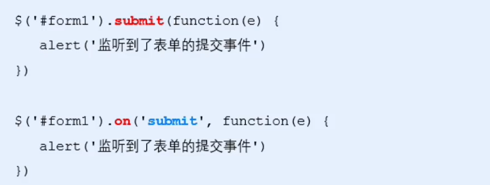
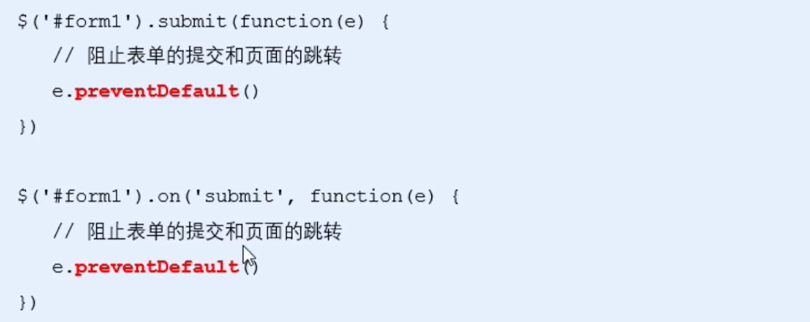

# 通过Ajax提交表单数据

# 监听表单提交事件

在jQuery中 可以用以下方式监听表单提交事件

​

# 阻止表单的默认提交行为

当监听到表单的提交时间以后, 可以调用事件对象的 event.preventDefault()函数, 来阻止表单的提交和页面的跳转

​

# 快速获取表单中的数据

## serialize() 函数

为了简化表单中数据的获取操作, jQuery提供了serialize() 函数, 

`$("").serialize()`

返回值: 包含了所有表单内容的字符串, 不同项目以&分隔

注意: 

* 表单项目必须包含name属性

serialize() 函数的好处, 可以一次性获取表单中的所有数据

```js
    <form action="">
        <input type="text" name="uname">
        <input type="text" name="pswd">
        <button type="submit">提交</button>
    </form>
    <script>
        $("form").on("submit",function (e) {
            e.preventDefault();
            console.log($("form").serialize()); //输出 uname=12312&pswd=312312
         })
    </script>
```

‍
