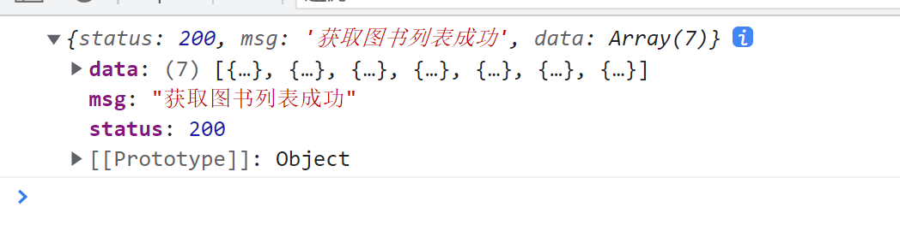
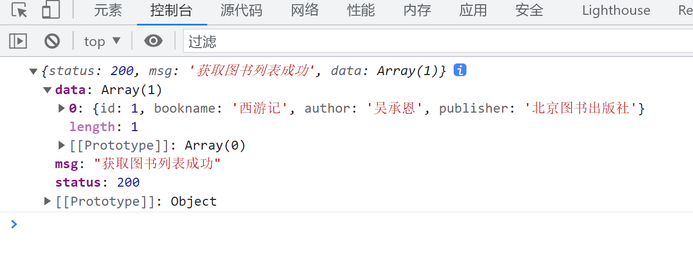

# jQuery中的Ajax

P浏览器中提供的XMLHttpRequest用法比较复杂, 所以jQuery对XMLHttpRequest进行了封装,提供了一系列Ajax相关的函数, 极大地降低了Ajax的使用难度

jQuery中发起Ajax请求最常用的三个方法如下

* $.get()
* $.post()
* $.ajax()

# $.get()方法的语法

jQuery中$.get()函数的功能单一, 专门用来发起get请求,从而将服务器上的资源请求到客户端来进行使用.

$.get()函数的语法如下:

`$.get(url,[data],[callback])`

其中, 三个参数代表的含义如下

|参数|数据类型|是否必填|说明|
| ----------| ----------| ----------| ------------------------|
|url|string|是|请求的资源地址|
|data|object|否|请求资源期间携带的参数|
|callback|function|否|请求成功时的回调函数,==形参为返回的数据==|

## 使用$.get() 发起不带参数的请求

```js
            $.get("http://www.liulongbin.top:3006/api/getbooks", function (res) {
                console.log(res);
            });
```

​

## 使用$.get() 发起带参数的请求

‍

```js
            $.get("http://www.liulongbin.top:3006/api/getbooks", { id: 1 }, function (res) {
                console.log(res);
            }); //带参数请求
```

​

## 

# $.post()方法的语法

jQuery中的$post()函数的功能单一, 专门用来发起post请求, 从而向服务器请求数据

$.post()的语法如下

`$.post(url,[data],[callback])`

其中, 三个参数代表的含义如下

|参数|数据类型|是否必填|说明|
| ----------| ----------| ----------| -----------------------|
|url|string|是|请求的资源地址|
|data|object|否|要提交的数据|
|callback|function|否|请求成功时的回调函数,==形参为返回的数据==|

## 使用$.post() 向服务器提交数据

‍

```js
            $(function () {
                $.post(
                    "http://www.liulongbin.top:3006/api/addbook",
                    { bookname: "myBook", author: "writer", publisher: "xxx publisher" },
                    function (res) {
                        console.log(res);
                    }
                );
            });
```

‍

# $.ajax() 方法

相比于$.get()和$.post(), jQuery中提供的$.ajax(), 是一个功能比较综合的函数, 它允许我们对ajax请求进行更详细的配置

语法:

‍

```js
            $.ajax({
                type: "get", //请求方式
                url: "http://www.liulongbin.top:3006/api/getbooks", //请求的url
                data: {}, //请求携带的数据
                success: function (res) { //情况成功的回调函数
                    console.log(res);
                },
            });
```

‍
