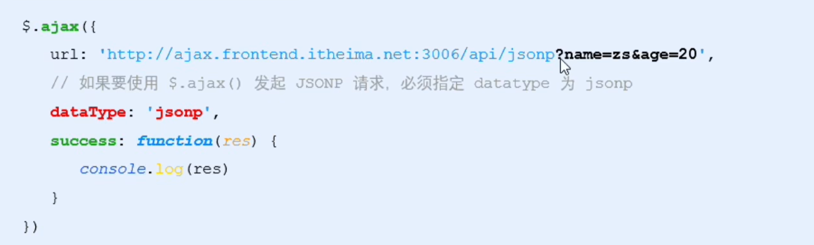
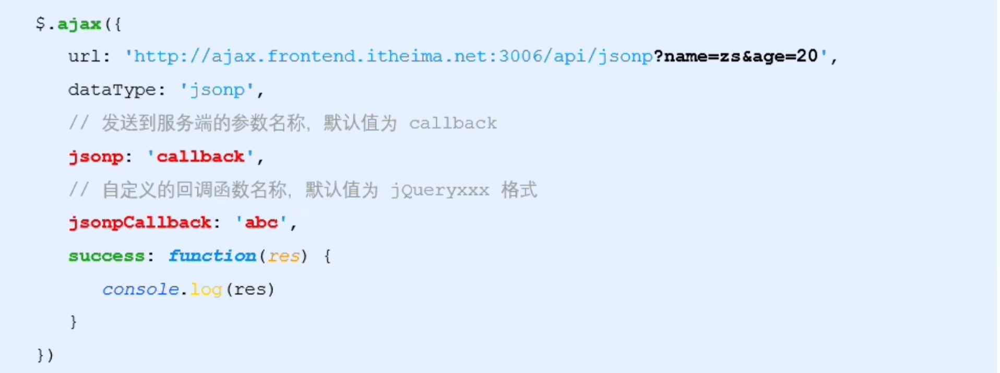

# JSONP

# 什么是 JSONP

JSONP (JSON with Padding) 是 JSON 的一种 "使用模式", 可用于解决主流浏览器的跨域数据访问问题

‍

# JSONP 的实现原理

由于 浏览器同源策略 的限制, 网页中无法通过 Ajax 请求非同源的接口数据, 但是 <script> 标签不受浏览器同源策略的影响, 可以通过 scr 属性, 请求非同源的 js 脚本

‍

因此, JSONP 的实现原理, 就是通过 <script> 标签的 scr 属性, 请求跨域的数据接口, 并通过函数调用的方式, 接收跨域接口相应回来的数据..

‍

# 自己实现一个 JSONP

‍

```js
        <script>
            function success(data) {
                console.log(data);
            }
        </script>
        <script src="http://www.liulongbin.top:3006/api/jsonp?callback=success&name=tim"></script>
```

# JSONP 的缺点

由于 JSONP 是通过 <script> 标签的 scr 属性, 来实现跨域数据请求的, 所以 JSONP 只支持 GET 数据请求, 不支持 POST 数据请求

‍

注意: JSONP 和 Ajax 之间没有任何关系, 不能把 JSONP 请求的方式叫做 Ajax, 因为 JSONP 没有用到 XMLHttpRequest 这个对象

‍

# jQuery 中的 JSONP

jQuery 中的 `$.Ajax() ​` 函数 除了可以发起真正的 Ajax 请求之外, 还能发起 JSONP 请求,

只需要把 `dataType` 设置为 `"jsonp"` 即可

​

默认情况下, 使用 jQuery 发起 JSONP 请求, 会自动携带一个 callback=jQueryxxx 的参数, , jQueryxxx 是随机生成的一个回调函数的名称

## 自定义参数及回调函数名称

在使用 jQuery 发起 JSONP 请求时, 如果想要自定义 JSONP 的参数及回调函数名称, 可以通过如下两个参数来定义

* jsonp: 发送到服务器的参数名称
* jsonpCallback: 自定义的回调函数名称

  ​

## jQuery 中 JSONP 的实现过程

jQuery 中的 JSONP, 也是通过 `<script>` 标签的 scr 属性实现跨域数据访问, 只不过, jQuery 采用的是动态创建和移除 `<script>` 标签的方式, 来发起 JSONP 数据请求

* 在发起 JSONP 请求的时候, 动态向 `<header>` 中 `append` 一个 `<script>` 标签
* 在 JSONP 请求成功之后, 动态从 `<header>` 中移除刚才 `append` 的 `<script>` 标签

‍
