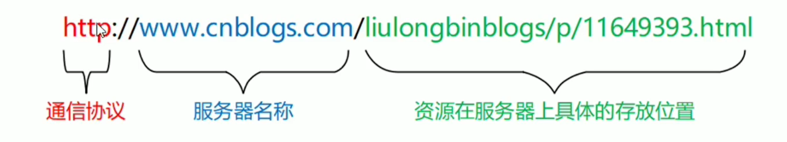

# 客户端与服务器

# URL地址

URL(统一资源定位符), 用于标识互联网上每个资源的唯一存放位置, 浏览器只有通过url地址, 才能正确的定位资源的存放位置, 从而访问相应的资源

## URL 的组成

1. 客户端与服务器之间的通信协议
2. 存有该资源的服务器名称
3. 资源在服务器上具体的存放位置

‍

# 客户端与服务器的通信过程

1. 客户端请求服务器
2. 服务器处理这次请求
3. 服务器响应客户端

    ==请求, 处理, 响应==

‍

# 网页如何请求数据

数据, 也是服务器对外提供的一种资源, 只要是资源, 必然要通过请求, 处理, 响应的方式进行获取

如果在网页中请求服务器上的数据资源, 需要用到 ==XMLHttpRequest== 对象

XMLHttpRequest 简称(xhr),  是浏览器提供的js成员, 通过它, 可以请求服务器上的数据资源

最简单的用法: `var xhrObj = new XMLHttpRequest();`

‍

# 资源的请求方式

客户端请求服务器时, 请求的方式有很多种, 最常见的两种请求方式分别为 ==get== 和 ==post== 请求

‍

* ==get==请求通常用于获取服务器资源 (==向服务器要数据==)

  例如: 根据 URL 地址 , 从服务器获取HTML文件, css文件, js文件, 图片文件等
* ==post==请求通常用于向服务器提交数据 (==往服务器发送数据)==

  例如: 登陆时向服务器提交的登录信息, 注册时向服务器提交的注册信息, 等各种数据提交操作

‍
