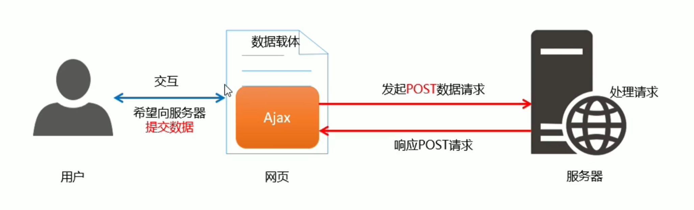

# 接口

# 接口的概念

使用Ajax请求数据是, 被请求的URL地址, 就叫做数据接口, 简称接口. 同时, 每个接口都有请求方式. 

# 分析接口的请求过程

## 通过GET方式请求接口的过程

​

## 通过POST请求接口的过程

​

‍

# 接口文档

## 什么是接口文档

接口文档, 就是接口的说明文档, 他是我们调用接口的依据, 好的接口文档包含了对接口URL, 参数以及输出内容的说明, 我们参照接口文档就能方便的知道接口的作用 以及接口如何进行调用

## 接口文档的组成部分

1. 接口名称: 有来表示各个接口的简单说明, 如登录接口, 获取图书列表接口
2. 接口URL: 接口的调用地址
3. 调用方式: GET 或 POST
4. 参数的格式: 接口需要传递的参数, 每个参数必须包含 ==参数名称, 参数类型, 是否必选, 参数说明.== 这四项内容
5. 响应格式: 接口的返回值的详细描述, 一般包含 数据名称, 数据类型, 说明 三项内容
6. 返回示例 (可选): 通过对象的形式, 列举服务器返回对象的结构

‍

‍
