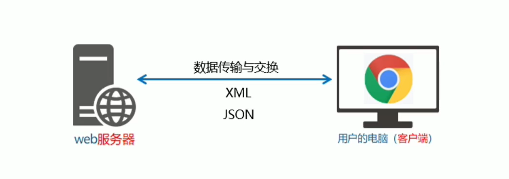
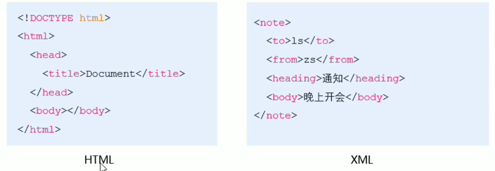
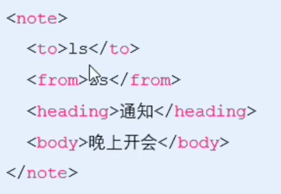
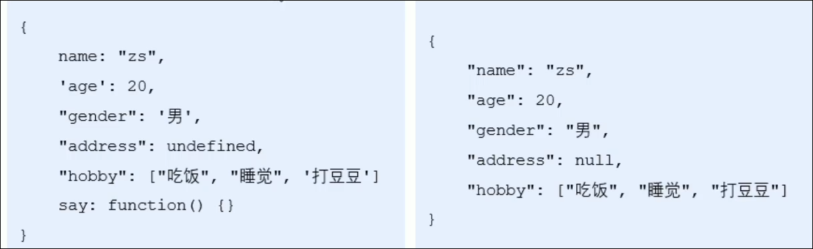
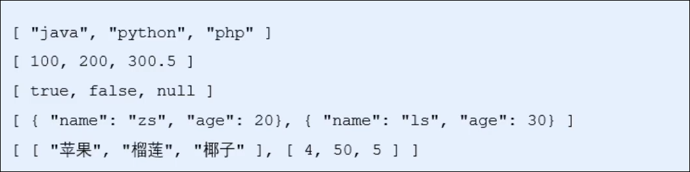
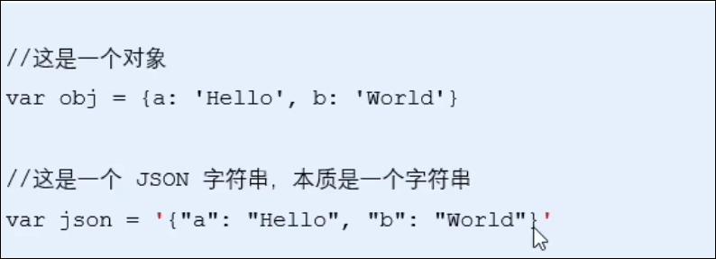
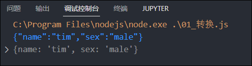

# 数据交换格式

数据交换格式, 就是服务器与客户端之间进行数据传输与交换的格式

前端领域, 经常提及的两种格式为`xml`与`json`, `xml`用的非常少, 重点学习`json`

​

# XML

xml的全称时 Extensible Markup language 可扩展标记语言, xml与html类似, 也是一种标记语言

​

## xml与html的区别

xml和html虽然都是标记语言, 但是, 它们两者之间没有任何关系

* html被设计用来描述网页上的内容, 是网页内容的载体
* xml用用来设计传输和存储数据, 是数据的载体

## xml的缺点

​

* xml格式臃肿, 与数据无关的代码多, 体积大, 传输效率低
* 在Javascript中解析xml比较麻烦

# JSON

概念: 

JSON的英文全称是Javascript Object Notation 即Javascript对象表示法, 简单来讲, ==JSON就是Javascript对象和数组的字符串表示法==, 它使用文本表示一个JS对象或数组的信息, 因此 ==JSON的本质就是字符串==

作用:JSOn是一种轻量级的文本数据交换格式, 在作用上类似xml,专门用于存储或传输数据, 但是JSON比XML更小, 更快, 更易解析

JSON是目前主流的数据交换格式

‍

## JSON的两种结构

JSON就是用字符串来表示JavaScript的对象和数组, 所以JSON中包含==对象==和==数组==两种结构, 通过这两种结构的相互嵌套, 可以表示各种复杂的数据结构

### 对象结构:

对象结构在JSON中表示为`{}`括起来的内容,  数据结构为`{key:value,key:value,...}`的键值对, 其中, `key`必须是使用英文双引号包裹的字符串, `value`的数据类型可以是数字, 字符串, 布尔值, null, 数组, 对象, 6种类型

​

‍

### 数组结构:

数组结构在JSON中表示为`[]`括起来的内容, 数据结构为`["js","java",30,true...], ​`数组中数据的类型可以是数字, 字符串, 布尔值, null, 数组, 对象6种.​

## JSON语法注意事项

* 属性名必须使用双引号包裹
* 字符串类型的值必须使用双引号包裹
* JSON中不允许使用单引号表示字符串
* JSON中不能写注释
* JSON的最外层必须是对象或数组形式
* 不能使用undefined或函数作为JSON的值

## JSON和JS对象的关系

JSON是JS对象的字符串表示法, 他使用文本表示一个JS对象的信息, 本质是一个字符串, ​

## JSON和对象的转换

* `JSON.stringify(obj);` 将对象转换为JSON
* `JSON.parse(json);` 将JSON转换为对象

```js
let obj = {
    name: "tim",
    sex: "male",
};
let json = JSON.stringify(obj);
console.log(json);

let obj2 = JSON.parse(json);
console.log(obj2);
```

​

‍

## 序列化和反序列化

将==数据对象转换为字符串的过程, 叫做序列化== 例如调用`JSON.stringify() ​`函数的操作, 叫做JSON序列化

‍

将==字符串转换为数据对象的过程, 叫做反序列化==, 例如, 调用`JSON.parse()`函数的操作, 叫做JSON反序列化
