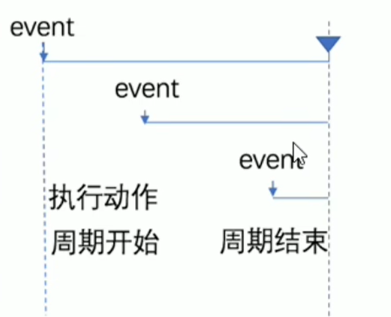

# 节流

# 什么是节流

节流策略(throttle), 顾名思义, 可以减少一段时间内事件的触发频率

​

# 节流的应用场景

* 鼠标连续不断的触发某事件, 只在单位时间内触发一次
* 懒加载时要监听并计算滚动条的位置, 但不必每次滑动都触发, 可以降低计算的频率, 而不必浪费 cpu 资源

  ‍

  ```js
      <body>
          <button>click me</button>
          <div>0</div>
          <script>
              let btn = document.querySelector("button");
              let div = document.querySelector("div");
              let timer = null;

              btn.addEventListener("click", function (e) {
                  if (timer) {
                      //如果定时器存在, 那么就退出不执行
                      return;
                  }
                  timer = setTimeout(() => {
                      div.innerHTML++;
                      timer = null; //执行完毕之后清空定时器
                  }, 1000);
              });
          </script>
      </body>
  ```
