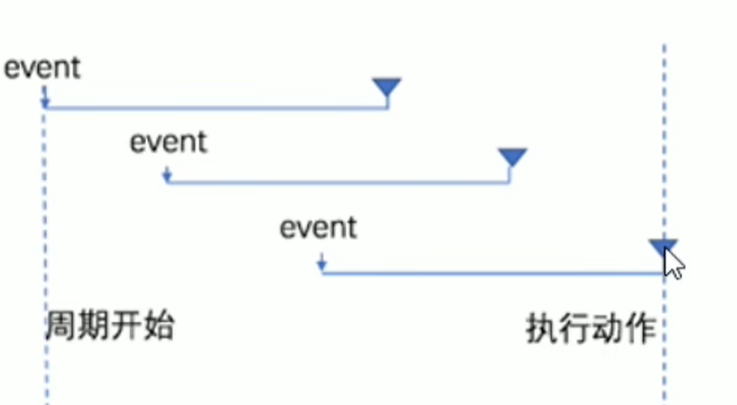

# 防抖

# 什么是防抖

防抖策略(debounce)是当事件触发后, 延迟 n 秒后再执行回调, ==如果在 n 秒内事件又被重新触发, 则重新计时==

​

# 防抖的应用场景

用户在输入框中连续输入一串字符时, 可以通过防抖策略, 只有在输入完成后, 才执行查询的请求, 这样可以有效减少请求次数, 节约请求资源

‍

# 实现输入框防抖

‍

```js
    let timer;

    $("#ipt").on("keyup", function () {
        //防抖
        clearTimeout(timer);
        timer = setTimeout(() => {
		code here //发送请求代码
        }, 200);
    });
```

如果200毫秒之内事件重新触发, 那么就取消定时器, 然后重新设置定时器
