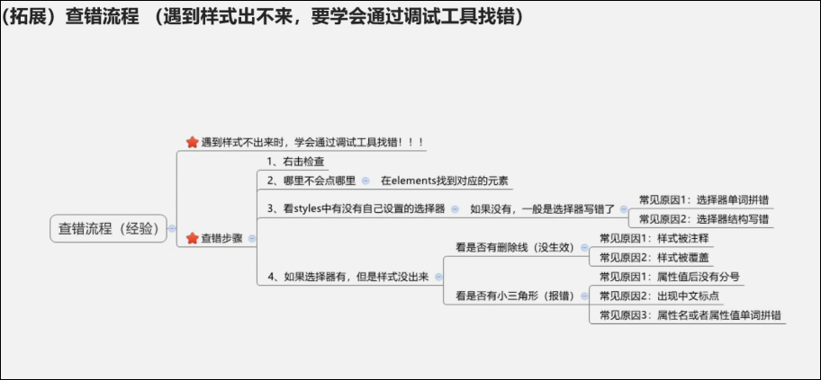

# CSS 引入方式 特性 书写顺序

# CSS引入方式

## 内嵌式: css写在style标签中

style标签虽然可以写在页面任意位置,但是通常约定写在

中.  
作用范围:当前文件  
使用场景:小案例

## 外联式: css写在独立的.css文件中

需要通过

标签引入  
作用范围:多个页面  
使用场景:项目

## 行内式: css写在标签的style属性中

之后配合js使用  
作用范围:当前标签  
使用场景:配合js使用

# CSS 特性

## 继承性

特性: 子元素可以继承父元素的样式  
可以继承的常见属性:

* color
* font-style, font-weight, font-size, font-family
* text-indent, text-align
* line-height
* ..

注意:

* 标签的固有属性不继承,  a标签不继承父标签的颜色, h标签不继承父标签的文字大小
* 可以通过调试工具判断是否可以继承

## 层叠性

特性:

* 给同一个标签设置不同的样式 , 样式会同时生效
* 给同一个标签设置相同的样式, 写在最后的样式生效

注意:  只有选择器优先级相同时, 才符合上述特性

## 优先级

特性: 不同的选择器有不同的优先级, 优先级高的选择器会覆盖掉优先级低的选择器  
选择器优先级:  从大到小  
!important>行内样式>id选择器>类选择器>标签选择器>通配符选择器>继承  
注意:

* !important 写在属性值的后面,  分号的前面 .
* !important 不能提升继承的优先级, 继承的优先级始终最低 .
* 实际开发中不建议使用 !important .

### 优先级的权重

​​

场景 : 如果是有多个复合选择器,此时需要通过权重叠加计算的方法, 判断哪个选择器优先级最高 .

==行内样式 &gt; id选择器 &gt; 类选择器 &gt; 标签选择器&gt;通配符选择器==

权重叠加计算公式 ( 每一级之间不存在进位)  
复合选择器中  行内样式个数 , id选择器个数 , 类选择器个数 , 标签选择器个数  
第一级    第二级    第三级    第四级  
0,      0,      0,      0  
比较规则: 从头开始比较, 如果数字相同则比较下一级.

注意:

* !important 如果不是继承, 那么始终优先级为最高 .
* 如果计算的权重相同, 那么根据层叠性, 后面的覆盖前面的
* 如果都是继承, 那么从里向外看, 里面的样式生效

```HTML
<style>
      /* 复合选择器优先级 行内 id 类 标签 */
      /* 0002 */
      div p {
        color: red !important;
      }
      /* 0020 */
      .a .c {
        color: green;
      }
      /* 0011 */
      .a p {
        color: black;
      }
      /* 0101 */
      #b p {
        color: blueviolet;
      }
      /* 0200 */
      #b #d {
        color: yellow;
      }
    </style>
```

# CSS 查错流程

在 Chrome 中, 右键检查,  查看标签是否有样式, 如果没有, 那么选择器写错了, 如果有感叹号, 那么语法有问题.



# CSS书写顺序


‍
