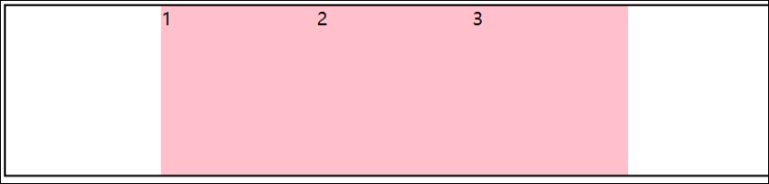

# Flex布局

Flex布局/弹性布局

* 是一种浏览器提倡的布局模型
* 布局网页更加简单. 灵活
* 避免浮动脱标的问题

## 作用

* 基于Flex精确灵活控制块级盒子的布局方式,避免浮动脱标
* flex布局非常适合结构化布局

## 设置方式

* 父元素添加 display: flex; 子元素可以自动地挤压或拉伸

## 组成部分

* 弹性容器
* 弹性盒子
* 主轴
* 侧轴 / 交叉轴

## 特点

* 设置display: flex; 后, 弹性盒子默认沿主轴排列

## 主轴对齐方式: justfy-content:

|属性值|含义|
| ------------| ------------------------------------|
|flex-start|默认值, 从起点开始依次排列, 左对齐|
|||


|||
| ----------| ----------------------------|
|flex-end|从终点开始依次排列, 右对齐|


|||
| --------| --------------|
|center|居中, 无间距|



|||
| --------------| ------------------------------------------------------------------------|
|space-around|居中均匀分布. 弹性盒子左右的边距相同, 效果是边框空间小, 盒子之间空间大|


|||
| ---------------| ----------------------------------------------------------|
|space-between|居中均匀分布, 弹性盒子与边框无间距, 弹性盒子之间间距相同|


|||
| --------------| ------------------------------------|
|space-evenly|真` 居中均匀分布, 所有间距完全相同|


## 侧轴对齐方式align-items / align-self

* align-items :添加到弹性容器, 设置所有弹性盒子的样式 (给父级)
* align-self: 控制某个弹性盒子在侧轴的对齐方式 (给子级)

|||
| ------------| ------------------------------------------------|
|属性值|含义|
|flex-start|上对齐|
|flex-end|下对齐|
|center|居中对齐|
|stretch|默认值, 当弹性盒子没有设置默认高度时, 拉伸高度|

## 多行弹性盒子侧轴对齐方式align-content

### align-items和 align-content的区别

相同点:

* 都用来设置对齐行为

不同点:

* align-items 设置对象是行内成员
* align-content设置对象是所有行, 只有在多行弹性盒子中才会生效

属性：align-content  
属性值：

|属性值|含义|
| ------------| ----------------------------|
|flex-start|从起点开始依次排列, 上对齐|


|||
| ----------| ----------------------------|
|flex-end|从终点开始依次排列, 下对齐|


|||
| --------| --------------|
|center|居中, 无间距|


|||
| --------------| ------------------------------------------------------------------------|
|space-around|居中均匀分布. 弹性盒子上下的间距相同, 效果是边框空间小, 盒子之间空间大|


|||
| ---------------| ----------------------------------------------------------|
|space-between|居中均匀分布, 弹性盒子与边框无间距, 弹性盒子之间间距相同|


|||
| --------------| ----------------------------------------|
|space-evenly|真` 垂直居中均匀分布, 所有间距完全相同|


## 弹性盒子尺寸

* 如果设置了宽高, 那么就为宽高
* 如果没有设置高度, 那么默认为拉伸高度, 除非align设置为非stretch
* 如果没有设置宽度, 那么宽度默认为内容宽度

## 弹性伸缩比

属性:flex  
属性值: 数字倍数  
含义:  
弹性盒子相对于盒子剩余部分的比例

```html
.box div:nth-child(1){
   flex: 1;
}
.box div:nth-child(2){
    flex: 2;
}
.box div:nth-child(3){
    flex: 3;
}
.box div:nth-child(4){
    flex: 4;
}
```

**给四个元素分别设置为1,2,3,4 **  
**那么四个元素的宽度比例为1:2:3:4**


## 修改主轴方向 flex-direction

|属性值|含义|
| ----------------| ------------------|
|row|默认值，从左往右|
|column|从上往下|
|row-reverse|从右往左|
|column-reverse|从下往上|

## 弹性盒子自动换行 flex-wrap

属性： flex-wrap  
属性值：

* wrap：换行
* nowrap： 默认，不换行
