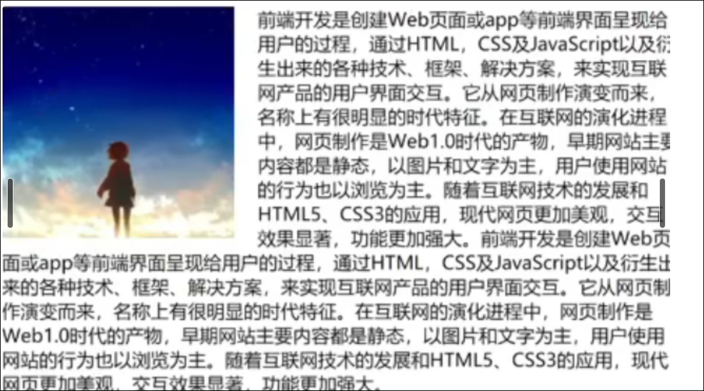
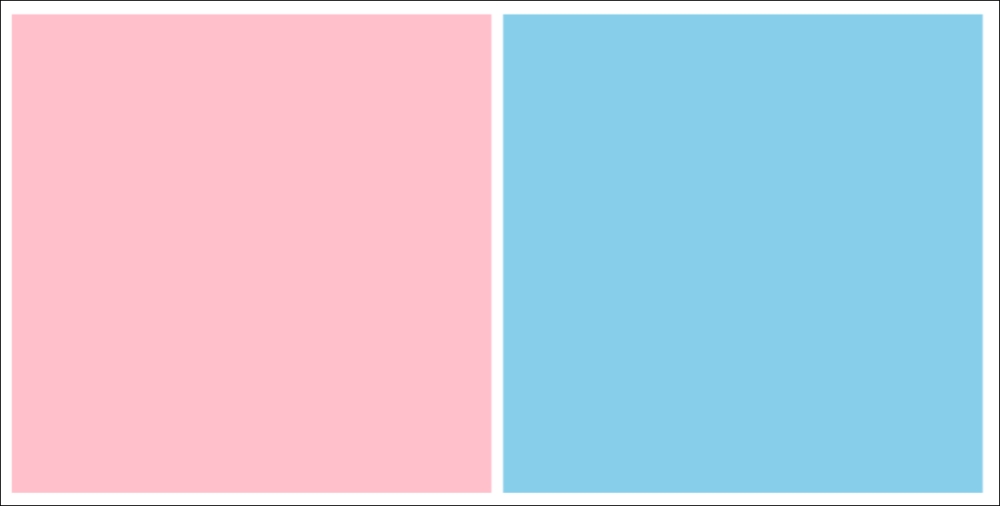
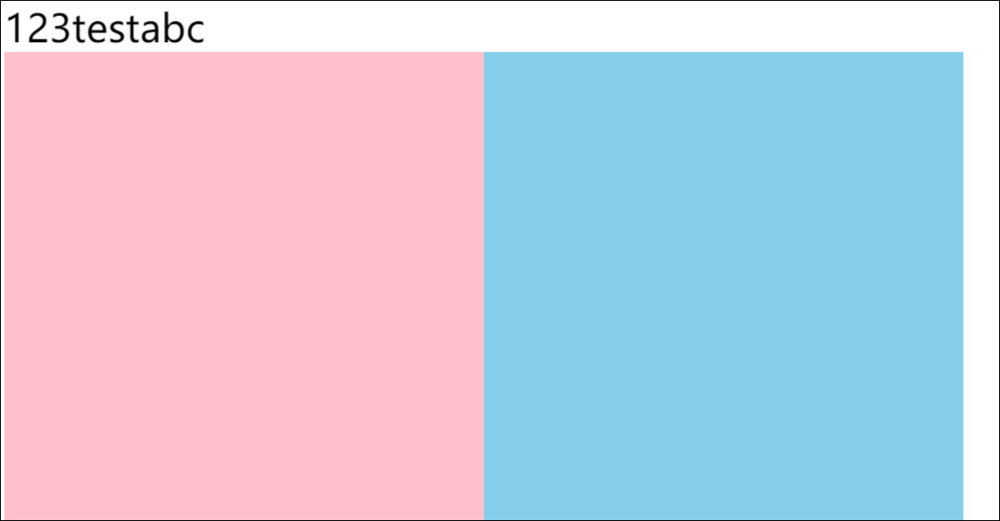

# 浮动 清除浮动

# 浮动

## 浮动的作用

早期作用：图文环绕



属性：float:left;

现在作用：网页布局  
设置为行内块的div之间会产生间距



解决方法：给div设置浮动

```HTML
.two{
    float: left;
    height: 200px;
    width: 200px;
    background-color: pink;
}

.three{
    float: left;
    height: 200px;
    width: 200px;
    background-color: skyblue;
}

```



## 浮动的代码

float:left/right

## 浮动的特点

* 浮动元素会脱离标准流（简称：脱标），在标准流中不占位置

  * 相当于从地面飘到了空中
* 浮动元素比标准流高半个级别，可以覆盖标准流中的元素

  * 文字不能被覆盖
* 浮动找浮动，下一个浮动标签会在上一个浮动标签的后面左右浮动
* 浮动元素有特殊的显示效果

  * 一行显示多个
  * 可以设置宽高
  * 浮动元素有行内块元素的特点，但是两个元素之间没有间距
* 注意

  * 浮动的元素不能通过text-align:center;或margin:0 auto; 来居中

# CSS属性书学顺序

1. 浮动/display
2. 盒子模型：margin padding border 宽度高度背景色
3. 文字样式

# 清除浮动

## 为什么要清除浮动

在父子级标签中，给子元素设置了浮动，如果父元素没有设置高度，那么后面的标准流会受影响。

## 清除浮动的方法

### 1. 给父元素设置高度

特点：  
优点 ： 简单粗暴，方便  
缺点： 有些布局中不能固定父元素高度，如新闻列表

### 2.额外标签法

操作：

1. 在父元素内容的最后添加一个块级元素
2. 给添加的块级元素设置 clear：both 清除左右两侧浮动的影响

特点：  
缺点：会在页面中添加额外标签，会让页面的HTML结构变复杂

### 3. 单伪元素标签法

使用伪类创建一个块级标签，和额外标签法原理相同  
使用伪类替代了额外标签

```HTML
.top::after{
    content: ' ';
    display: block;
    clear: both;

    /* 为了兼容性添加 */

    height: 0;
    visibility: hidden;
}
```

特点：  
优点：在项目中使用，直接给标签添加样式即可清除浮动

### 4. 双伪元素消除法

使用：

```HTML
.clearfix::after,
.clearfix::before{
    content: '';
    display: table;
}
.clearfix::after{
    clear: both;
}
```

特点：  
优点：既可以消除元素塌陷问题，又可以清除浮动

### 5. 给父元素设置 overflow：hidden

overflow属性的作用，设置当子元素超出父元素的显示范围后的行为  
hidden：隐蔽  
scoll：会出现滚动条

特点：  
优点：方便
