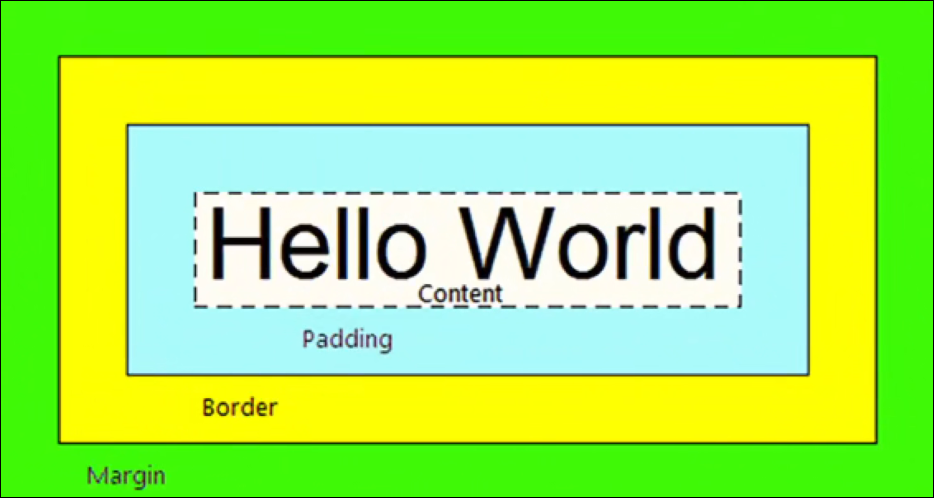
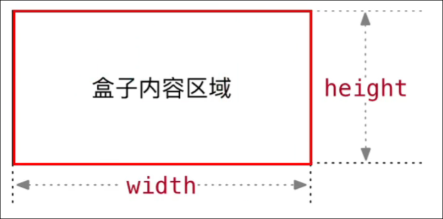
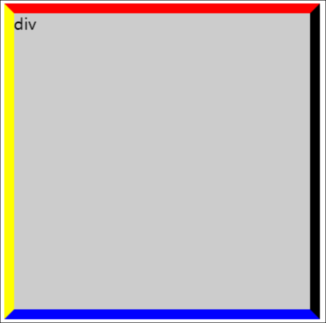
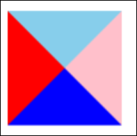
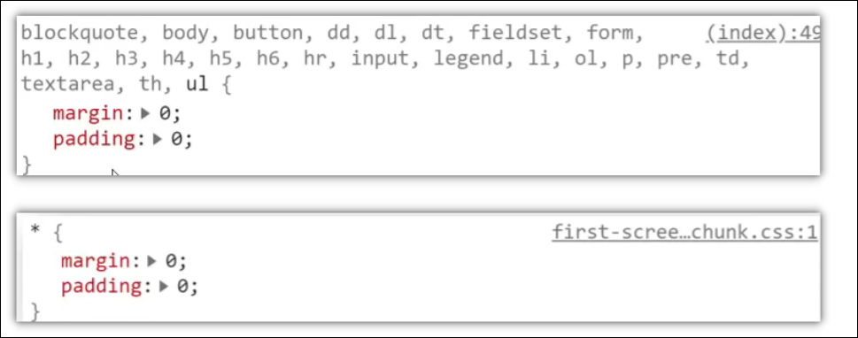

# 盒子模型

# CSS 盒子模型

## 盒子模型的介绍

盒子模型的概念:

* 页面中的每一个标签, 都可看作一个" 盒子" ,通过盒子的视角更方便进行布局
* 浏览器在渲染网页时, 会将页面中的元素看作一个个的矩形区域, 我们也形象的称之为盒子

盒子模型:

* css规定每个盒子分别由: 内容区域, ( content ) , 内边距区域 ( padding ) , 边框区域 ( border ) , 外边距区域 ( margin ) 组成, 这就是盒子模型.

可以理解为现实生活中的包装盒



## 内容区域的宽度和高度

为什么height:100%没有效果 ?

作用:  利用 width 和 height 属性默认设置盒子 内容区域 的大小  
属性: width / height  
常见取值 ： 数字+px



## 内边距 ( padding )

### padding单独属性：

属性名 ： padding-top / right / bottom / left  
属性值： 数字+px

### padding复合属性：

属性名：padding  
属性值：数字+px  
例如： padding： 10px 5px 15px 20px  
和border一样，也支持四个取值

## 边框 ( border )

### border-单独属性

作用：给边框设置粗细， 边框样式，边框颜色效果  
属性：

|作用|属性名|属性值|
| ----------| --------------| ------------------------------------|
|边框粗细|border-width|数字+px|
|边框样式|border-style|实线 solid 虚线 dashed 点线 dotted|
|边框颜色|border-color|颜色取值|

注意： 可以给单独属性设置最多四个取值，顺时针给元素设置样式；

|取值数量|样式生效方向|
| ----------| ----------------|
|1|上下左右|
|2|上下  左右|
|3|上  左右  下|
|4|上  下  左  右|

记忆： 无论多少个取值， 顺时针给元素边框应用， 遇到没有取值的，取对面的值

```html
<!DOCTYPE html>
<html lang="en">
  <head>
    <meta charset="UTF-8" />
    <meta http-equiv="X-UA-Compatible" content="IE=edge" />
    <meta name="viewport" content="width=device-width, initial-scale=1.0" />
    <title>Document</title>
    <style>
      div {
        background-color: #ccc;
        height: 300px;
        width: 300px;
        border-color: red black blue yellow;
        border-style: solid;
        border-width: 10px;
      }
    </style>
  </head>
  <body>
    <div>div</div>
  </body>
</html>

```



### border-连写属性

属性名：border （bd）  
属性值：边框宽度 边框样式 颜色  
如：`border：1px solid red；`

### border-单方向设置

属性名：border-top / right / bottom/ left  
属性值：连写的取值

**border会撑开box的尺寸,如果不想需要设置box-sizing属性**

[盒子模型](https://www.wolai.com/v2FeDdCQwokq3ciV85Q7cP#qHPYG7rpvstbnSnWaJzKNB)

### 如何用边框画三角形



通过给一个没有宽高的盒子设置边框来实现

1. 首先设置一个盒子
2. 设置宽高为0
3. 给盒子设置边框高度
4. 设置合适的边框颜色,可以制作出合适的三角形

```HTML
.sjx {
  border: 40px solid;
  border-color: skyblue pink blue red;
  width: 0;
  height: 0;
}
```

## 外边距 ( margin )

### maigin 单独属性

属性名： margin-top / right / bottom / left  
属性值：数字+px

### margin 复合属性

属性名：maigin  
属性值：数字+px  
和padding一样， 支持四个取值

## CSS3 自动內减

width 和 height 默认设置的是内容的宽度和高度，当设置了 padding border margin 后， 盒子尺寸会发生变化  
此时可以使用CSS3的新特性：自动內减

属性名：box-sizing : boder-box ;  
浏览器会自动计算多余大小，自动设置合适的内容大小。

## 清除默认内外边距

场景：浏览器会默认给部分标签设置默认的 margin 和 padding ， 但一般在项目中会清除默认的 margin 和 padding， 后续自己设置。  
比如： 	body 标签默认有 margin：8px  
p标签默认有上下的margin  
ul标签中有上下的 margin 和 padding-left

解决方法：



## CSS版心居中

设置属性： margin : 0 auto ;

必须给盒子设置宽度!!

## 外边距折叠现象

### 合并现象

场景： 垂直布局的块级元素 上下的 margin 被合并  
结果：最终两者距离为 margin 的最大值  
解决方法： 尽量避免， 只给其中一个设置 margin

### 塌陷现象

场景： 互相嵌套的块级元素， 子元素的 margin-top 会作用于父元素上。  
结果： 导致父元素一起向下移动.  
解决办法：

* 给父元素设置 border-top 或者 padding-top
* 给父元素设置 overflow：hidden；
* 转换成行内块元素
* 设置浮动

### 行内元素的内外边距不生效

对于行内元素 如 span 或 a ， margin 和 padding 的上下边距不生效， 如果要设置高度可以使用 line-height
