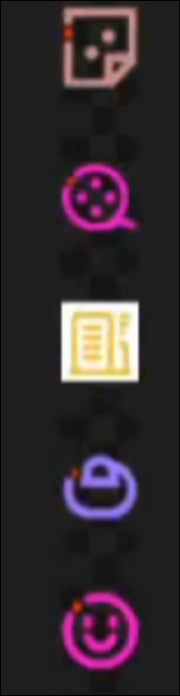

# 精灵图

# 精灵图

场景：多个小图片拼接而成的大图称为精灵图，为盒子设置一张大图作为背景，然后设置背景位置即可  
优点：减少服务器发送次数，减轻服务器压力，提高页面加载速度

使用步骤：

1. 首先测量想要显示的小图片的尺寸
2. 给盒子设置小图片的宽高
3. 给盒子设置背景图片
4. 测量小图左上角在大图中的坐标
5. 设置background-position属性，属性值为坐标负数

# 精灵图动画

精灵图逐帧动画
