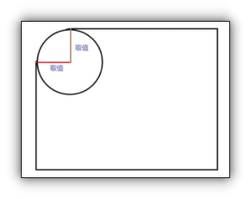

# 装饰

## 目录

*   [垂直对齐方式 vertical-align](#垂直对齐方式-vertical-align)

*   [光标类型 cursor](#光标类型-cursor)

*   [边框圆角 border-radius](#边框圆角-border-radius)

*   [overflow溢出部分显示效果](#overflow溢出部分显示效果)

*   [元素本身隐蔽display:none / visibility:hidden](#元素本身隐蔽displaynone--visibilityhidden)

*   [元素整体透明 opacity](#元素整体透明-opacity)

*   [文字阴影 text-shadow](#文字阴影-text-shadow)

*   [盒子阴影 box-shadow](#盒子阴影-box-shadow)

*   [过度 transition](#过度-transition)

*   [合并表格边框 border-collapse: collapse;](#合并表格边框-border-collapse-collapse)

*   [文字溢出text-overflow](#文字溢出text-overflow)

# 垂直对齐方式 vertical-align

场景：解决行内/行内块元素的垂直对齐问题 问题：当图片和文字在一行显示时，底部其实不是对齐的 浏览器解析行内块和行内元素时，当作文字处理，所以产生了基线对齐问题 属性名：vertical-align 属性值：

| 属性值      | 效果      |
| -------- | ------- |
| baseline | 默认，基线对齐 |
| top      | 顶部对齐    |
| middle   | 居中对齐    |
| bottom   | 底部对齐    |

# 光标类型 cursor

场景：设置鼠标光标在元素上显示的样式 属性名：cursor 属性值：

| 属性值     | 含义             |
| ------- | -------------- |
| default | 默认 通常是箭头       |
| pointer | 小手 提示用户可点击     |
| text    | 工字形 初春丧失可以选择文字 |
| move    | 十字光标， 提示用户可以移动 |

# 边框圆角 border-radius

场景：让盒子四个角便圆润，增加页面细节，提升用户体验 属性名：border-radius 常见取值：数字+px ， 百分比



赋值规则：从左上角顺时针赋值，没有赋值的看对角

如何画一个正圆

*   首先必须是正方体

*   将border-radius取值设置为50%

如何画一个胶囊形

*   首先必须是长方体

*   将border-radius设置为长方体高度的一半

# overflow溢出部分显示效果

溢出部分：指的是盒子内容部分超出盒子范围的区域 场景：控制盒子溢出部分的显示效果，如 显示，隐蔽，滚动条 属性名：overflow 属性值：

| 属性值     | 效果                      |
| ------- | ----------------------- |
| visible | 默认值，显示                  |
| hidden  | 隐蔽溢出部分                  |
| scroll  | 无论是否溢出都显示滚动条，而且底部也会有滚动条 |
| auto    | 根据是否溢出自动选择是否显示水平和垂直的滚动条 |

# 元素本身隐蔽display:none / visibility:hidden

有两种方式可以隐藏元素

| 属性                 | 效果                |
| ------------------ | ----------------- |
| visibility: hidden | 只是视觉上不可见，但是仍然占据位置 |
| display：none       | 彻底隐藏              |

# 元素整体透明 opacity

作用：让某元素整体（包括内容）变透明 属性名 opacity 属性值：0-1之间的数字 0表示完全透明 1表示完全不透明

注意：opacity会让元素整体透明，包括里面的内容如文字， 子元素

# 文字阴影 text-shadow

属性名：text-shadow
属性值：水平偏移 垂直偏移 模糊 颜色
如         text-shadow:   2px 3px 5px black;
注意,文字阴影可以叠加设置,每组阴影用逗号隔开


# 盒子阴影 box-shadow

作用：给盒子添加阴影
属性名：box-shadow
属性值：

| 属性值      | 含义       |
| -------- | -------- |
| h-shadow | 水平偏移量，必填 |
| v-shadow | 垂直偏移量，必填 |
| blur     | 模糊度，选填   |
| spread   | 扩大度，选填   |
| color    | 阴影颜色，选填  |
| inset    | 内阴影，选填   |

```text
box-shadow:10px 10px 10px 3px black;

```


# 过度 transition

作用：让元素的样式缓慢变化，常配合hover实现，增强网页体验
属性名：transition
属性值:

| 属性值   | 含义                                       |
| ----- | ---------------------------------------- |
| 过度的属性 | all：过度所有能过度的属性，或者写具体属性名：width，box-shadow |
| 过度的速度 | 数字+s                                     |

注意：

*   默认状态与hover样式不同，才能有过渡效果

*   transition属性给需要过度的元素本身加

*   给默认状态设置，鼠标移入移出都有过度

*   给hover设置，只有移入有过度，移出没有

# 合并表格边框 border-collapse: collapse;


# 文字溢出text-overflow

如何让文字超出显示省略号

属性:text-overflow
控制文字溢出的显示效果
clip: 直接切断
ellipsis: 显示为三个点

```html
table {
     border-collapse: collapse;
   }
```
