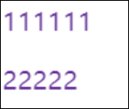
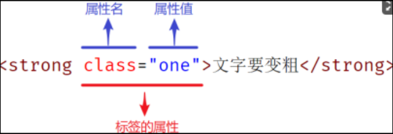

# 选择器

# 基础选择器

选择器作用:选择页面中对应的标签, 方便后续设置样式

## 标签选择器

结构: 标签名{ css属性名: 属性值 ; } 作用: 通过标签名, 找到页面中所有这类标签, 设置样式 注意

* 标签选择器选择的是一类标签, 而不是某一个
* 标签选择器无论嵌套关系有多深, 都能找到

## 类选择器

结构: 定义类 .+类名{属性名:属性值; } 通过类名,找到页面中所有有这个类名的标签, 设置样式 注意

* 所有标签都有class属性, class属性值为类名
* 类名可以由数字字母下划线中划线组成,但不能由数字中划线开头
* 一个标签可以同时有多个类名, 多个类名中间由空格隔开
* 类名可以重复, 一个类选择器可以选择多个标签

## id选择器

结构: 定义id #id属性值{ 属性名: 属性值; } 通过id属性值, 找到页面中有这个id的标签. 设置样式 注意

* 所有标签都有id属性
* id属性是唯一的, 不可重复
* 一个标签上只能有一个id属性
* 一个id选择器只能选择一个标签

一般配合js使用

## 通配符选择器

结构: *{ css属性名: 属性值; } 作用:找到页面中所有标签,设置样式 注意

* 开发中使用极少, 指在特殊情况下会使用
* 在小页面中可能会用于去除标签默认的margin和padding

# 复合选择器

## 后代选择器: 空格

作用： 根据HTML标签的嵌套关系， 选择父元素 后代中 符合条件的元素  
选择器语法 ： 选择器1 选择器2 {css}  
结果 ：在选择器1中所找的标签的后代， 找到符合选择器2 的标签， 设置样式  
注意：

* 后代包括：儿子，孙子， 重孙子
* 后代选择器中， 选择器与选择器之间通过空格隔开
* 后代选择器， 选择的是所有的后代。

```html
<!-- 选择器进阶 -->
<!DOCTYPE html>
<html lang="en">

    <head>
        <meta charset="UTF-8">
        <meta http-equiv="X-UA-Compatible" content="IE=edge">
        <meta name="viewport" content="width=device-width, initial-scale=1.0">
        <title>Document</title>
        <style>
            body p {
                color: rebeccapurple;
            }

        </style>
    </head>

    <body>
        <p>111111</p>
        <div>
            <p>22222</p>
        </div>


    </body>

</html>
```



## 子代选择器 ：>

作用 ： 根据HTML标签的嵌套关系， 选择父元素中 子代中 符合条件的元素  
选择器语法： 选择器1 > 选择器2 { css }  
结果：

* 在选择器1中所找的标签的子代中， 找到满足选择器2的标签设置样式。

注意：

* 子代只包括： 儿子
* 子代选择器中， 选择器与选择器之间通过 > 隔开
* 子代选择器只选中儿子

## 并集选择器： ，

作用： 同时选中相同的标签， 设置相同的样式  
选择器语法： 选择器1， 选择器2 { css }  
结果

* 找到选择器1和选择器2的标签 设置样式

注意点：

* 并集选择器中的每个标签之间通过 ，间隔
* 并集选择器中的每个标签可以是基础选择器或复合选择器
* 并集选择器中的每组选择器通常一行写一个， 提高代码可读性

## 交集选择器：紧挨着

作用：选中页面上 同时满足 多个选择器的标签  
选择器语法： 选择器1选择器2{css}  
结果：

* 找到页面同同时满足条件的元素

注意点：

* 交集选择器中的选择器之间是紧挨着的， 没有分隔
* 交集选择器如果有标签选择器， 标签选择器必须在最前面

## hover伪类选择器 ：冒号

作用：选中鼠标悬停在元素上的状态， 设置样式、  
选择器语法： 选择器：hover{css}  
注意 ：

* 伪类选择器选中的元素的某种状态

# 选择器拓展

## 链接伪类选择器

场景:用来设置链接的不同状态 选择器语法

|选择器语法|效果|
| ------------| ------------------------|
|a:link{}|链接未被访问的状态|
|a:visit{}|链接被访问过之后的状态|
|a:hover{}|鼠标悬停的效果|
|a:active{}|鼠标按下的效果|

如果想要同时实现效果,需要按照顺序设置: L V H A 不光能对链接生效

## 网页焦点选择器

**input:focus{}**

一般用于更改输入框的样式

## 属性选择器



|选择器|含义|
| ---------------| -----------------------------------------|
|E[attr]|选择具有attr属性的标签|
|E[attr="val"]|选择具有attr属性并且属性值等于val的标签|

例如: 选中网页中所有文本框 input[type="text"] { }

## 选择器需要注意的问题

* 选择器可以重名，设置的样式可以同时生效，但是相同的样式会覆盖
* html标签可以设置多个类名，用空格隔开

## emmet语法

|||
| ---------------------------------| -----------------------------------------------------------------------------------------------------------------------------------------------------------------------------------|
|直接写标签名 如div p|<div></div><br><br> <p></p>|
|类选择器 .red|<div class="red"></div>|
|id选择器 #a|<div id="a"></div>|
|交集选择器 p.red#a|<p class="red"id="a"></p>|
|子代选择器 ul>li<br><br>div>p>p|<ui><br><br>    <li></li><br><br></ui><br><br>       <div><br><br>           <p><br><br>               <p></p><br><br>           </p><br><br>       </div>|
|内部文本 ui>li{文本}|<ul><br><br>           <li>文本</li><br><br> </ul>|
|创建多个 ul>li{text}*5|<ul><br><br>           <li>text</li><br><br>           <li>text</li><br><br>           <li>text</li><br><br>           <li>text</li><br><br>           <li>text</li><br><br></ul>|
|创建多个递增 ul>li{$}*5|<ul><br><br>           <li>1</li><br><br>           <li>2</li><br><br>           <li>3</li><br><br>           <li>4</li><br><br>           <li>5</li><br><br></ul>|

### css快速补全

|直接写单词首字母 如lh fsz|line-height font-size|
| ----------------------------| -----------------------|
|多个属性连写 如h200+w300+c|height: 200px;|

```text
        width: 300px;
        color: #000; |
```

# 结构伪类选择器

作用：根据元素在HTML中的结构关系查找元素 优势： 减少对HTML中类的依赖，有利于保持代码简洁 场景：用于查找某父级选择器的子元素 选择器：

|选择器|说明|
| -----------------------| -----------------------------------------|
|E:first-child{}|匹配父元素的第一个子元素，并且是E元素|
|E:last-child{}|匹配父元素的最后一个子元素，并且是E元素|
|E:nth-child(n){}|匹配父元素的第n个元素，并且是E元素|
|E:nth-last-chile(n){}|匹配父元素的倒数第n个元素，并且是E元素|

n的取值： n为0123456... n可为公式：

|功能|公式|
| ------------------| ---------------|
|偶数|2n,even|
|奇数|2n+1,2n-1,odd|
|找到前五个|-n+5|
|找到从第五个往后|n+5|
|5，10，15个|5n|

# 伪元素

一般页面中的非主体内容可以使用伪元素 区别： 元素：由HTML代码设置的标签 伪元素：由CSS样式模拟的标签效果 种类：

|伪元素|作用|
| ----------| ------------------------------------|
|::before|在父元素内容的最前面添加一个伪元素|
|::after|在父元素内容的最后面添加一个伪元素|

注意：

* 必须设置content属性才能生效
* 伪元素默认是行内元素
