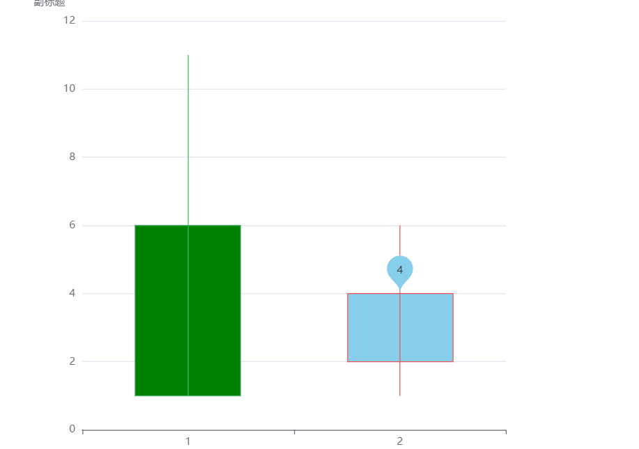

# k线图 candlerStick

# data格式

```js
                data: [
                    // 初值, 终值, 最低值, 最高值
                    [6, 1, 11, 1],
                    [2, 4, 6, 1],
                ],
```

```js
        const option: ECOption = {
            title: {
                text: "标题",
                subtext: "副标题",
                left: "left",
                top: "left",
            },
            tooltip: {
                trigger: "axis",
                axisPointer: {
                    type: "cross",
                },
            },
            xAxis: {
                data: [1, 2],
            },
            yAxis: {},
            series: {
                name: "test",
                type: "candlestick",
                data: [
                    // 初值, 终值, 最低值, 最高值
                    [6, 1, 11, 1],
                    [2, 4, 6, 1],
                ],
                itemStyle: {
                    color: "skyblue", // 上涨颜色
                    color0: "green", // 下跌颜色
                },
                markPoint: {
                    data: [{ name: "最da值", type: "max", valueDim: "close" }],
                },
            },
        };
```

‍
