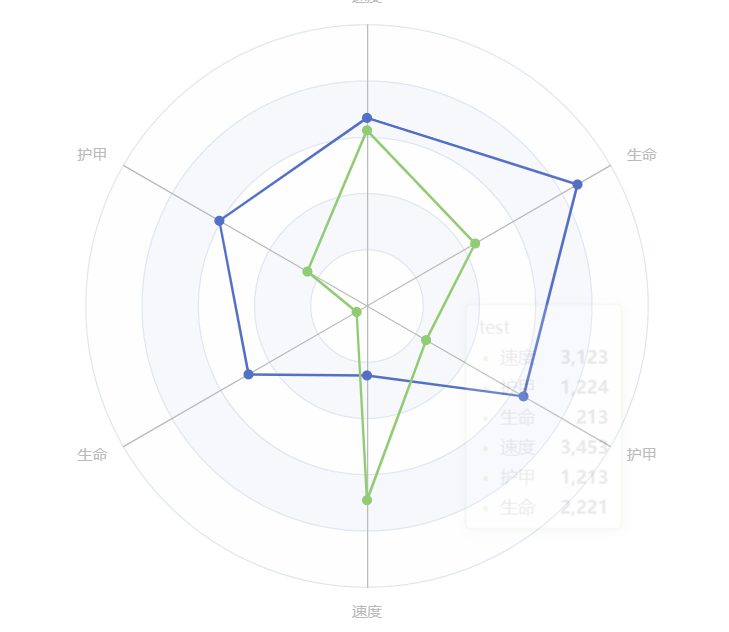

# 雷达图 radar

雷达图拥有特殊配置项 `radar`​, 需要在其中配置`indicator`​, 配置每个维度

```js
            radar: [
                {
                    shape: "circle",
                    // 设置维度
                    indicator: [
                        {
                            name: "速度",
                            // 维度的最大值
                            max: 5000,
                        },
                        {
                            name: "护甲",
                            max: 5000,
                        },
                        {
                            name: "生命",
                            max: 5000,
                        },
                        {
                            name: "速度",
                            max: 5000,
                        },
                        {
                            name: "护甲",
                            max: 5000,
                        },
                        {
                            name: "生命",
                            max: 5000,
                        },
                    ],
                },
            ],
```

# data格式

```js
                data: [
                    {
                        value: [3344, 3030, 2432, 1235, 3213, 4321],
                    },
                    {
                        value: [3123, 1224, 213, 3453, 1213, 2221],
                    },
                ],
```

# 配置文件

```js
        const option: ECOption = {
            title: {
                text: "标题",
                subtext: "副标题",
                left: "left",
                top: "left",
            },
            tooltip: {},
            radar: [
                {
                    // 形状
                    shape: "polygon",
                    // 半径
                    radius: "60%",
                    // 起始角度
                    startAngle: 200,
                    // 分隔数
                    splitNumber: 10,

                    // 设置维度
                    indicator: [
                        {
                            name: "速度",
                            // 维度的最大值
                            max: 5000,
                        },
                        {
                            name: "护甲",
                            max: 5000,
                        },
                        {
                            name: "生命",
                            max: 5000,
                        },
                        {
                            name: "速度",
                            max: 5000,
                        },
                        {
                            name: "护甲",
                            max: 5000,
                        },
                        {
                            name: "生命",
                            max: 5000,
                        },
                    ],
                },
            ],
            series: {
                name: "test",
                type: "radar",
                areaStyle: {},
                data: [
                    {
                        value: [3344, 3030, 2432, 1235, 3213, 4321],
                    },
                    {
                        value: [3123, 1224, 213, 3453, 1213, 2221],
                    },
                ],
            },
        };
```
