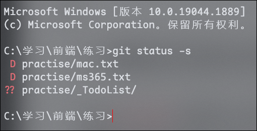
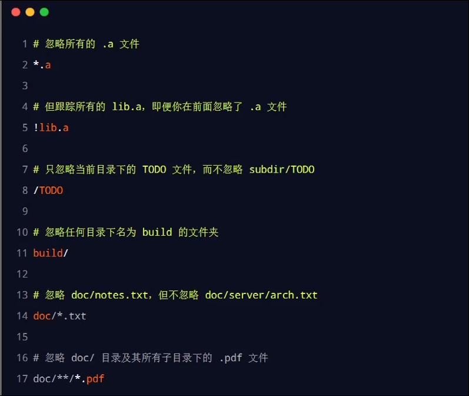
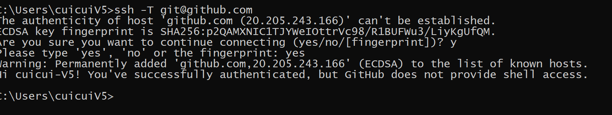
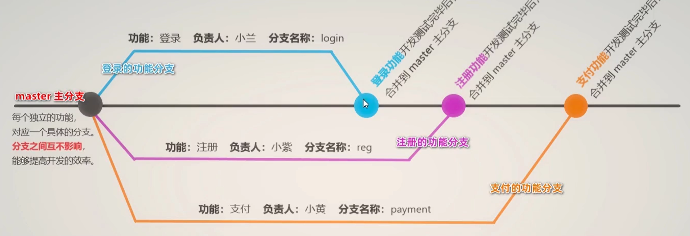
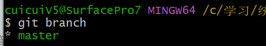

# Git的使用

# 配置用户信息

设置用户名和密码

```powershell
git config --global user.name "username"
git config --global user.email "email"

```

* 如果使用了 --globa 选项, 那么该命令只需要运行一次, 即可永久生效

‍

# 创建仓库的两种方式

## 从现有目录初始化仓库

```js
git init
```

## 克隆远程仓库

```js
git clone 远程仓库地址
```

# 常用命令:

## 查看配置信息

```powershell
查看所有全局配置
git config --list --global 

查看指定的全局配置项
git config user.name
git config user.email

删除git配置
git config --globle --unset

配置git走代理
git config --global http.proxy socks5://127.0.0.1:1080
git config --global https.proxy socks5://127.0.0.1:1080
//取消全局代理
git config --global --unset http.proxy
git config --global --unset https.proxy
```

## 获取帮助信息 help

```powershell
获取某个命令的详细帮助 (在浏览器打开)
git help <verb> 

获取简明帮助
git <verb> -h 
```

## 检查文件状态 status

`git status`

### 以精简的方式显示文件状态

```js
git status --short

git status -s
```

​

‍

`??` 表示未跟踪

`A` 表示刚添加到暂存区

`M` (红色)已修改但没有被添加到暂存区

`M` (绿色)已修改且已经被添加到暂存区

## 跟踪新文件 add

```js
添加某个文件
git add 文件名 

将所有新增和修改过的文件都加入暂存区
git add . 
```

‍

### `git add` 的三个功能

* 可以用来开始跟踪新文件
* 把已跟踪的, 且已修改的文件放到暂存区
* 把有冲突的文件标记为已解决

‍

## 提交更新 commit

可以使用 `git commit -m "message"` 提交更新, 其中 `-m ​` 后面的是提交的信息, 用来对提交内容进行描述

### 跳过使用暂存区

在提交时, 给 `git commit` 加上 `-a ​` 选项, Git 就会把所有已经追踪过的文件暂存起来一并提交, 从而跳过 `​ git add` 步骤

`git commit -a -m "msg"`

‍

## 撤销对文件的更改 checkout

如果修改文件出错了, 想要还原为Git仓库中的状态

把工作区内对应文件的修改, 还原成 Git 仓库中保存的版本

==所有的操作会丢失,且无法恢复, 要谨慎操作==

`git checkout --文件名`

撤销操作的本质, 就是用 Git 仓库中的文件, 覆盖工作区中的文件

‍

## 移除暂存的文件 reset

如果要从暂存区中移除对应的文件, 可以使用如下的命令

‍

```js
移除特定文件
git reset HEAD 文件名 

移除全部文件
git reset HEAD .  
```

‍

## 从 Git 仓库中移除文件 rm

```js
从Git仓库和工作区同时移除文件
git rm -f 文件名 

从Git仓库中移除文件, 但是保留工作区中的文件, 文件变为未追踪状态
git rm --cached 文件名 
```

‍

## 查看提交历史 log

```js
按时间先后顺序列出所有提交历史
git log 

展示最新的n调提交历史
git log -n

在一行上展示
git log -2 --pretty=online

按照指定格式输出
git log -2 --pretty=format:" 提交哈希值: %h | 作者: %an | 修改日期: %ar | 提交说明: %s"
```

‍

## 回退到指定的版本 reset

步骤:

1. 先查看提交历史: `​ git log`
2. 根据提交 id 回退到指定的版本 `​ git reset --hard <commit id>`
3. 在旧版本中使用查看所有提交历史  `git reflog`
4. 再次根据提交 id, 切换版本 `​ git reset --hard <commit id>`

‍

## 比较文件差异 diff

```js
git doff <文件名>
git diff HEAD -- readme.txt
```

‍

## 保存工作现场 stash

```js
git stash

查看保存的stash
git stash list

恢复到指定stash
git stash apply stash@{0}

删除特定satsh
git stash drop

删除并且恢复satsh
git stash pop
```

‍

## 将某分支的commit合并到当前分支

```js
git cherry-pick <commit>
```

‍

‍

# 忽略文件

我们可以创建一个 `.gitignore` 的配置文件, 列出需要忽略的文件的匹配模式

`.gitignore` 的格式规范如下

* `#` 开头的为注释
* 以 `/` 结尾的是目录
* 以 `/` 的防止递归
* 以 `!` 开头表示取反
* 可以使用 `glob` 模式进行文件和文件夹的匹配

## glob 模式

所谓 glob 模式就是简化了的正则表达式

* `*` 表示 零或多个任意字符
* `[abc] ​` 匹配任何一个方括号中的字符
* `? ​` 只匹配一个任意字符
* `[a-z] ​` 表示范围
* `** ​` 表示匹配任意中间目录

​

‍

‍

# 远程仓库的使用

## 生成 ssh key

```powershell
ssh-keygen -t rsa -b 4096 -C "email"
```

即可在 `user/.ssh` 中找到 ssh key

## 测试 ssh

在 github 添加 ssh 后, 使用如下命令测试

```powershell
ssh -T git@github.com
```

​

‍

## 添加远程仓库

‍

```powershell
git remote add origin <仓库地址>
```

## 基于 ssh 将本地仓库上传到 Github

```powershell
第一次推送
git push -u origin master

后续推送
git push
```

‍

## 将远程仓库克隆到本地

```powershell
git clone <仓库地址>
```

## 删除远程库

```js
git remote rm <name>
```

## git pull 强制覆盖本地的代码

```shell
git fetch --all
```

然后，你有两个选择：

```shell
git reset --hard origin/master
```

或者如果你在其他分支上：

```shell
git reset --hard origin/<branch_name>
```

‍

# 本地分支操作

## 分支在开发中的作用

在进行多人协作开发的时候, 为了防止互相干扰, 提高协同开发的体验, 建议基于分支进行项目功能的开发​

## master 主分支

在初始化本地Git仓库的时候, Git默认已经帮我们创建了一个名字叫做master的分支, 通常我们把这个默认的 master 分支叫做主分支

在实际工作中, master主分支的作用是, ==用来保存和记录整个项目已完成的功能和代码==

因此, 不允许程序员直接在master分支上修改代码, 因为这样做的风险太高, 容易导致整个项目崩溃

## 功能分支

功能分支指的是专门用来开发新功能的分支, 他是临时从master分支上分叉出来的, 当新功能开发并测试完毕后, 最终需要合并到master分支上

‍

## 查看分支列表

```powershell
git branch
```

​

‍

## 创建新分支

使用如下命令, 可以基于当前分支, 创建一个新的分支, 此时, 分支中的代码和当前分支完全一样

```powershell
git branch <分支名称>
```

注意: 创建完成后, 当前还处于master分支, 不会切换分支

‍

## 切换分支

使用如下命令, 可以切换到指定的分支上进行开发

```powershell
git checkout <分支名>

新版git
git switch <分支名>

```

‍

## 创建并切换到分支

可以使用如下命令创建并切换到此分支

```powershell
-b 表示创建一个新分支
git checkout -b <分支名称>

git switch -c <分支名>
```

‍

## 合并分支

```bash
切换到master分支
git checkout master

在 master 分支上运行git merge 命令, 将login分支的代码合并到master分支
git merge login
```

注意: 假设要把C分支合并到A分支, 那么要先切换到A分支, 再运行git merge C

‍

## 删除分支

当把功能分支的代码合并到master主分支上以后, 就可以使用如下的命令, 删除对应的功能分支

```powershell
git branch -d <分支名称>
```

‍

## 有冲突的分支合并

如果在两个不同的分支中, 对同一个文件进行了不同的修改, Git就没法干净的合并他们, 此时我们需要打开这些包含冲突的文件然后手动解决他们

```powershell
把reg分支合并到master分支, 代码发生了冲突
git checkout master
git merge reg

打开包含冲突的文件, 手动解决冲突之后, 再执行命令
git add .
git commit -m "解决了分支合并冲突的问题"
```

‍

# 远程分支操作

## 将本地分支推送到远程仓库

如果是第一次将本地分支推送到远程仓库, 需要运行如下命令

```powershell
-u 表示将本地分支和远程分支进行关联, 只需存在第一次推送的时候带-u参数
git push -u 远程仓库名称 本地分支名称:远程分支名称

git push -u origin payment:pay

如果希望远程分支的名称和本地分支的名称保持一致, 可以对命令进行简化
git push -u origin payment
```

## 查看远程仓库的分支列表

可以通过如下命令查看远程仓库中所有的分支信息

```powershell
git remote show <远程仓库名称>
```

‍

## 跟踪远程分支

跟踪分支指的是, 从远程仓库中, 把远程分支下载到本地仓库中, 需要以下命令

```powershell
从远程仓库中, 把对应的远程分支下载到本地仓库, 保持本地分支和远程分支名称相同
git checkout <远程分支的名称>

从远程仓库中, 把对应的远程分支下载到本地仓库, 并把下载的本地分支进行重命名
git checkout -b 本地分支名称 远程仓库名称/远程分支名称
```

## 拉取远程分支的最新的代码

可以使用如下代码, 吧远程分支最新的代码下载到本地对应的分支中

```powershell
git pull
```

`git pull`会直接用远程内容合并本地内容,如果想手动合并, 可以使用 git fetch

```powershell
git fetch
```

`git fetch`是将远程主机的最新内容拉到本地，用户在检查了以后决定是否合并到工作本机分支中。

而`git pull` 则是将远程主机的最新内容拉下来后直接合并，即：`git pull = git fetch + git merge`，这样可能会产生冲突，需要手动解决。

## 删除远程分支

可以使用如下命令, 删除远程仓库中指定的分支

```powershell
git push <远程仓库名称> --delete <远程分支名称>
```
