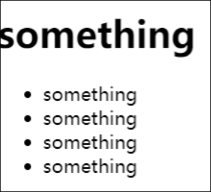
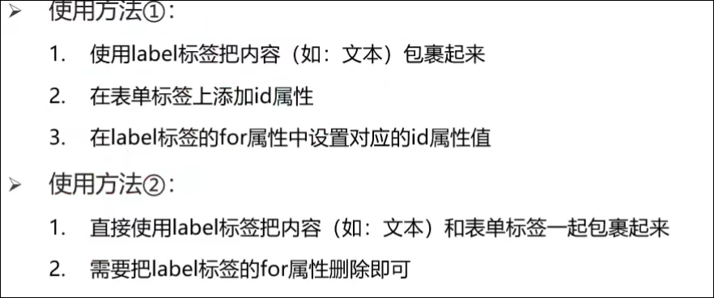

# 列表标签 表格标签 表单标签 语义化标签

# 列表标签

## 无序列表

```html
    <ul>
        <li>something</li>
        <li>something</li>
        <li>something</li>
        <li>something</li>
    </ul>
```

在网页中显示没有顺序的列表，如 新闻标题



### 标签组成

|标签名|含义|
| --------| --------------------------------|
|ul|无序列表的整体，用于包裹li标签|
|li|无序列表的每一行|

注意

1. 列表的每一项都默认显示圆点标识

## 有序列表

在浏览器中显示一组有顺序之分的列表

```html
    <ol>
        <li>something</li>
        <li>something</li>
        <li>something</li>
        <li>something</li>
        <li>something</li>
    </ol>
```


### 标签组成

|标签名|含义|
| --------| --------------------------------|
|ol|有序列表的整体，用于包裹li标签|
|li|有序列表的每一行|

注意

1. 列表的每一项都默认显示序号

## 自定义列表

网站的底部导航通常使用自定义列表实现

```html
    <dl>
        <dt>dt</dt>
        <dd>dd</dd>
        <dt>dt</dt>
        <dd>dd</dd>
        <dd>dd</dd>
    </dl>
```


|标签名|说明|
| --------| --------------------------------------|
|dl|自定义列表的整体，用于包裹dt、dd|
|dt|用于自定义列表的主题|
|dd|表示自定义列表的针对主题的每一项内容|

注意

## 去掉列表前面的装饰，圆点 数字

添加css样式： `list-style：none；`

# 表格标签

在网页中显示表格

```html
    <table>
        <tr>
            <td>something1</td>
            <td>something2</td>
            <td>something3</td>
        </tr>
        <tr>
            <td>something4</td>
            <td>something5</td>
            <td>something6</td>
        </tr>
    </table>
```


|标签名|含义|
| --------| -------------------------|
|table|表格整体，可用于包裹tr|
|tr|每一行，用于包裹td|
|td|每个单元格,用于包裹内容|

## 相关属性

|属性名|含义|
| --------| ----------|
|border|边框宽度|
|width|宽度|
|height|高度|

实际开发中通常使用css样式

## 表格标题和表头单元格标签

```html
    <table border="3">
        <caption>head</caption>
        <tr>
            <th>233</th>
            <th>233</th>
            <th>233</th>
        </tr>
        <tr>
            <td>something1</td>
            <td>something2</td>
            <td>something3</td>
        </tr>
        <tr>
            <td>something4</td>
            <td>something5</td>
            <td>something6</td>
        </tr>
    </table>
```


|标签名|含义|
| ---------| --------------------------------|
|caption|表格的标题|
|th|表格头单元格，内部文字加粗居中|

注意

## 表格的结构标签

|标签名|含义|
| --------| ----------|
|thead|表格头部|
|tbody|表格主体|
|tfoot|表格底部|

注意

1. 结构标签用于包裹标签
2. 结构标签可以省略

## 合并单元格

步骤

1. 明确合并哪几个单元格
2. 通过左上原则，明确保留谁，删除谁
3. 给保留的单元格设置属性：跨行合并，或跨列合并

|||
| ---------| -------------------|
|属性|含义|
|rowspan|跨行合并,垂直合并|
|colspan|跨列合并,水平合并|

注意，只有同一个结构标签内的单元格才能合并，不能跨结构标签合并

## 去除表格边框

合并表格边框 border-collapse: collapse;

# 表单标签

## input系列标签

作用：在网页中收集用户的信息的表单效果  
标签名：input  
通过更改type属性,展示不同效果

```html
   <input type="text" placeholder="233">
    <br>
    <input type="password">
    <br>
    <input type="radio">1
    <input type="radio">2
    <input type="radio">3
    <br>
    <input type="checkbox">
    <br>
    <input type="file">
    <br>
    <input type="submit">
    <br>
    <input type="reset">
    <br>
    <input type="button">
    <br>
```


|type属性值|含义|
| ------------| ------------------------------------------|
|text|文本框，用于输入单行文本|
|password|密码框，用于输入密码|
|radio|单选框|
|checkbox|复选框|
|file|用于选择文件上传|
|submit|用于提交|
|reset|重置按钮|
|button|普通按钮，默认无功能，需要配合js实现功能|

### text/password

|属性名|含义|
| --------| --------------------------|
|******placeholder**|占位符，提示用户输入内容|

如果想设置placeholder的样式，使用伪类  
input::placeholder{  
css样式  
}

### radio/checkbox

|属性名|含义|
| ---------| ----------------------------------------------------|
|name|分组，有相同name的为一组。一组之中只有一个能被选中|
|checked|默认选中|

### file

|属性名|含义|
| ----------| ------------|
|multiple|多文件选择|

### submit/reset/button

|属性名|含义|
| --------| ----------|
|value|按钮文字|

如果要实现功能，需要使用

标签包裹起来表单体

## button按钮标签

```html
    <button type="button"> 
        this is button
    </button>
```

显示一个按钮, 功能同input


## select下拉列表标签

作用： 在网页中提供多个菜单的下拉菜单列表控件

```html
    <select>
        <option  selected>1</option>
        <option >2</option>
        <option>2</option>
    </select>
```

标签组成


|标签名|含义|
| --------| -----------------------------|
|select|下拉菜单整体,用来包裹option|
|option|下拉菜单的每一项|

常见属性:  
selected: 默认选中

## textarea文本域标签

可在网页中提供输入多行文本的区域

```html
    <textarea cols="30" rows="10" placeholder="32131">
      
    </textarea>
```

常见属性

|属性名|含义|
| --------| ------|
|cols|宽度|
|rows|行数|

注意:  
右下角可以拖拽设置大小  
实际开发中通常使用css设置样式

可以使用 ==resize: none;== 来关闭调节大小图标

## label标签

常用于绑定内容与表单标签的关系, 例如,点击文字也能选择单选/复选框  
label有两种使用方法

```html
   方法1 将label的for设置为和input相同的id

  <input type="radio" name="1" id="1"><label for="1">111</label>

   方法2 将input和文本用label包裹起来，删除for

  <label><input type="radio" >1111</label>

```



# 语义化标签

## 没有语义的布局标签

div和span  
div会自动换行  
span不会换行

## 有语义的布局标签

html5中推出的新标签


