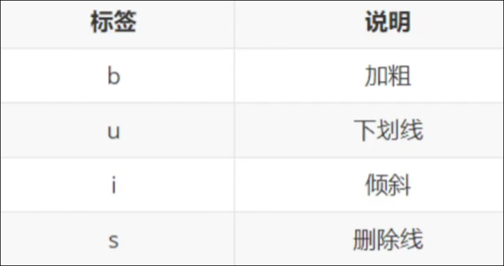
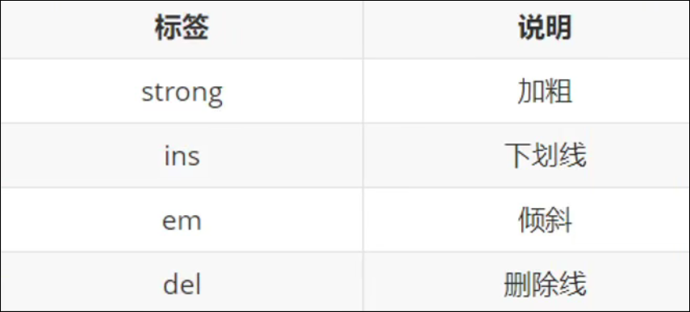

# 排版标签 文本格式化标签 媒体标签 链接标签

# 排版标签

## 标题标签

```html
<h1>一级标题</h1>
<h2>二级标题</h2>
...
<h6>六级标题</h6>
```

### 特点

1. 文字都有加粗,
2. 文字逐渐变小
3. 文字独占一行

---

## 段落标签

```html
<p>段落内容</p>
```

### 特点

1. 段落之间存在间隙
2. 独占一行,会自动换行

---

## 强制换行  <br> 标签

## 分割线 <hr> 标签

# 文本格式化标签





# 媒体标签

## 图片标签

```html

```

### 属性

1. src : 图片路径
2. alt : 替换文本, **当图片显示失败时显示的文字**
3. title : 提示文本. **鼠标悬停时显示** title不光可以给图片标签, 还可以给其他标签
4. width 和 height :宽度与高度, 如果只设置一个,另一个会自动等比缩放, 如果设置两个,设置不当会让图片变形,
5. 不要使用中文文件名；

### 特点

1. 单标签
2. 需要添加标签属性来设置效果 属性名="属性值"

### 标签属性的特点

1. 标签的属性写在开始标签内部
2. 标签上可以同时存在多个属性
3. 属性之间以空格隔开
4. 标签名和属性之间必须以空格隔开
5. 属性之间没有顺序之分

## 绝对路径 相对路径(常用)

### 绝对路径

绝对路径: 目录下的绝对位置,可直接到达目标位置,通常从盘符开始写  
例如:d:\233\233.jpg  
或者是完整的网址

### 相对路径

相对路径: 从当前文件开始， 找目标文件  
当前文件: 当前的html文件  
目标文件: 要找的图片  
相对路径分类：

1. 同级目录： 直接写文件名， 或者 ./文件名
2. 下级目录： 文件夹名/文件名
3. 上级目录:    ../文件名 (../可以回到上级目录, 如果要回到多个上级目录,可以用多个../../../

## 音频标签 <audio>

```html
    <audio src="" controls autoplay loop></audio>

```

在页面中插入音频

|属性名|功能|
| ----------| ----------------|
|controls|显示控制控件|
|autoplay|自动播放（ **大部分浏览器不支持** ）|
|loop|控制循环|
|src|文件路径|

注意：目前支持mp3, wav , ogg 格式

## 视频标签 <video>

```html
    <video src="" controls autoplay loop muted></video>

```

在页面中播放视频

|属性名|功能|
| ----------| -------------------------------------------|
|controls|显示控制控件|
|autoplay|自动播放（增加muted可以实现静音自动播放）|
|loop|控制循环|
|src|文件路径|
|muted|静音|

注意：目前支持mp3, webM, ogg 格式

# 链接标签<a>

```html
<a href="跳转地址">超链接</a>
<a href="#">空链接</a>
```

超链接

|属性|功能|
| --------| -----------------------------------------------|
|target|_self  在原网页中打开 _blank 在新标签页中打开|
