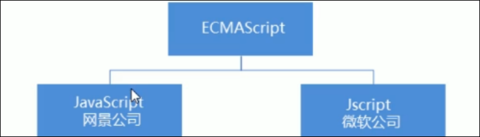

# JavaScript基础

Javascript是一种运行于客户端的脚本语言

脚本语言: 不需要编译, (但是需要预解析), 运行过程中通过js解释器**逐行**进行解释和执行

现在也可以使用node.js 进行服务器编程

# JavaScript作用

* 表单动态检验( 密码强度检测 ) *** js最初目的***
* 网页特效
* 服务端开发 ( node.js )
* 桌面程序 ( Electron)
* App ( Cordova )
* 控制硬件- 物联网 ( Ruff )
* 游戏开发 ( cocos2d-js )

# HTML / CSS / JavaScript 关系

* HTML决定网页结构和内容(决定看到什么) 相当于人的身体
* CSS 决定网页呈现给用户的模样, 决定好不好看
* JavaScript 实现业务逻辑和页面控制, 相当于人的各种动作

# JavaScript 的组成

* ***ECMAScript***  
  ECMAScript是由ECMA国际( 原欧洲计算机制造商协会 ) 进行标准化的一门编程语言, 这种语言再万维网上应用广泛, 他往往称为JavaScript或JScript, 但实际上后两者是ECMAScript语言的实现和拓展.  
  ​  
  ECMAScript:ECMAScript规定了JS的编程语法和基础核心知识, 是所有浏览器厂商共同遵守的一套JS语法工业标准
* ***DOM: 文档对象模型***  
  文档对象模型( Document Object Model , 简称DOM ) , 是W3C组织推荐的处理可拓展标记怨言的标准编程接口, 通过DOM提供的接口可以对页面上的各种元素进行操作 ( 大小 位置 颜色等).
* ***BOM: 浏览器对象模型***  
  BOM(Browser Object Model ,简称BOM) 是指浏览器对象模型, 它提供了若干独立于内容的, 可以与浏览器窗口进行互动的对象结构, 通过BOM可以操作浏览器窗口, 比如弹出框, 控制浏览器跳转, 获取分辨率等.
