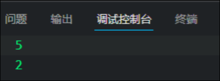

# String 字符串

# 基本包装类型

为了方便操作基本数据类型, JavaScript还提供了三个特殊的引用类型,  String, Number, Boolean

* 基本包装类型就是把简单数据类型包装成复杂数据类型, 这样基本数据类型就有了属性和方法.

```JavaScript
var str = "tim";
console.log(str.length);
```

按道理基本数据类型是没有属性和方法的, 而对象才有属性和方法, 但上面代码却可以执行, 这是因为JS会把基本数据类型包装称为复杂数据类型, 其执行过程如下:

```JavaScript
//1 生成临时变量, 把简单类型包装为复杂数据类型
var temp = new String("tim");
//2 赋值给生命的字符变量
str = temp; 
//3 销毁临时变量
temp = null;
```

# 字符串的不可变

值得是里面的之不可变, 虽然看上去可以改变内容, 但其实是地址变了内存中新开辟了一个内存空间

```JavaScript
var str = "abc" ;
str = "hello";
//当重新给str赋值的时候, 常量abc不会被修改, 依然在内存中
//重新给字符串赋值, 会重新在内存中开辟空间, 这个特点就是字符串的不可变
//由于字符串的不可变, 在大量拼接字符串的时候会有效率问题
var str = "";
for (var i = 0; i<100000; i++){
  str += i;
} 
console.log(str); //这个结果需要花费大量时间显示, 因为需要不断开辟新的空间
```

# 查找字符串中的内容

字符串所有的方法, 都不会修改字符串本身, ( 字符串本身是不可变的), 操作完成会返回一个新的字符串

## indexOf("要查找的字符", 开始位置)

* 返回指定内容在元字符串中的位置, 如果找不到就返回-1

## lastindexOf("要查找的字符", 开始位置)

* 从后往前找, 其他如上

```JavaScript
        var str="abecdcefg";
        console.log(str.indexOf("c",4));
        console.log(str.lastIndexOf("e",4));
```



# 根据索引号返回字符

|||
| -------------------| -----------------------------|
|方法|说明|
|charAt(index)|返回索引号处的字符|
|charCodeAt(index)|返回索引号处的字符的ASCII码|
|str[index]|获取索引号处的字符|

# 字符串操作方法

|||
| ------------------------| -----------------------------------------------------|
|方法|说明|
|concat(str1,str2, ...)|连接字符串, 等同于+|
|substr(start[,length])|从start开始, 取length个 ,第二个参数不写则截取到最后|
|slice(start,end)|从start开始 截取到end, end 取不到|
|substring(start,end)|和slice基本相同, 但是不接受负值|

# replace字符串替换

用法: replace("要替换的字符串","替换为的字符串")

注意:

* replace只能替换一次

# split字符串转换为数组

用法: split("分隔符");

* 如果想一个字单独存放数组, 那么`split("")`

# toUpperCase() 转换大写

# toLowerCase() 转换小写
