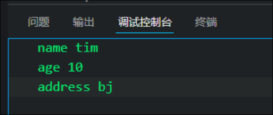

# 自定义对象

# 什么是对象

对象是一个具体的事物, 在JavaScript中, 对象是一组无序的相关属性的方法的集合, 所有的事物都是对象, 例如字符串, 数值, 数组, 函数等.

对象是由属性和方法组成的

## 属性

事物的特征, 在对象中用属性表示( 常用名词 )

## 方法

事物的行为, 在对象中用方法表示,( 常用动词 )

# 创建对象的三种方式

在JS中, 现阶段我们可以采用三种方式创建对象 ( object)

* 利用字面量创建对象
* 利用new object创建对象
* 利用构造函数创建对象

## 利用字面量创建对象

对象字面量: 就是花括号{}里面包含了表达这个具体事务( 对象 )的属性和方法

```JavaScript
var tim = {
                name: "tim",
                age: 18,
                say: function () {
                    console.log(this.name);
                },
            };
            tim.say();
```

注意:

* 对象内的属性或方法采用的是键值对的形式.  属性名: 属性值
* 多个属性或方法之间采用逗号隔开
* 方法的冒号后面跟的是匿名函数 函数表达式 (匿名函数)

## 利用new object 创建对象

```JavaScript
            var xiaoming = Object();
            xiaoming.name = "xm";
            xiaoming.age = 18;
            xiaoming.say = function () {
                console.log(this.name);
            };
            xiaoming.say();
```

注意:

* 利用等号赋值的方法来添加对象的属性和方法
* 每个属性和方法之间用分号结束;
* Object 注意大小写
* 调用和之前方法一样

## 利用构造函数创建对象

构造函数: 是一种特殊的函数, 主要用来初始化对象, 即为对象成员变量赋初始值, 他总与new运算符一起使用, 我们可以把对象中一些公共的属性和方法抽取出来, 然后封装到这个函数里面

### 构造函数的声明

```JavaScript
function 构造函数名(){
this.属性 = 值; 
this.方法 = function(){}
}
```

### 构造函数的使用

```JavaScript
new 构造函数();
```

```JavaScript
var Person = function (name, age) {
                this.name = name;
                this.age = age;
                console.log("construster"); //构造函数里面的语句在new的时候就执行了
                this.say = function () {
                    console.log(this.name);
                };
            };
            var jack = new Person("jack",18);
            jack.say();
```

注意:

* 构造函数的首字母要大写
* 构造函数不需要return就可以返回结果
* 调用构造函数必须使用new
* 使用new调用构造函数后, 就创造了一个对象,
* 构造函数内的属性和方法前面要加this
* 构造函数里面的语句在new的时候就执行了

### 构造函数和对象的区别

* 对象是一个具体的事物, 比如tim
* 构造函数是泛指的一大类, 类似java的class
* 我们利用构造函数创建对象的过程, 称为对象的实例化

### 实例化

我们利用new构造函数创建对象的过程, 称为对象的实例化

## new关键字工作流程

1. new构造函数会在内存中生成一个空的对象
2. 构造函数内的this会指向这个空对象
3. 执行构造函数内部的代码, 给空对象添加属性和方法
4. 返回这个对象( 所以不需要return )

---

# 使用对象

## 调用对象的属性

```JavaScript
        console.log(user.name); //方法1
        console.log(user["name"]); //方法2
```

### 方法一

采用 对象名.属性名 的方法来调用对象的属性

### 方法二

采用 对象名["属性名"]; 的方法调用

### 条件式属性访问 es6[^1]

`obj?.属性名`

`obj?.[属性]`

## 调用对象的方法

使用 对象名.方法名() 实现

### 条件式调用方法 es6

`obj.m?()`

# 遍历对象属性

## for in 循环

for in 语句用于循环遍历对象的属性

for (变量 in 对象 )

```JavaScript
            var obj = {
                name: "tim",
                age: 10,
                address: "bj",
            };
            for (k in obj) {
                console.log(k, obj[k]);
            }
```



注意:

* 变量k输出的是属性名
* 可以用obj[k]得到属性值
* 变量名通常是k 或 key

# 变量 属性: 函数方法:的区别

## 变量和属性的相同点:

* 都是用来存储数据的

## 不同点:

* 变量单独声明并赋值, 使用的时候直接写变量名 单独存在
* 属性在对象里面, 不需要声明, 使用的时候必须 对象.属性 不能单独使用

## 函数和方法的相同点

* 都是实现某种功能

## 不同点

函数是单独声明, 单独调用的, 单独存在

方法在对象里面,  调用的时候需要对象.方法() 不能单独使用

[^1]: # JavaScript进阶面向对象ES6

    ‍
