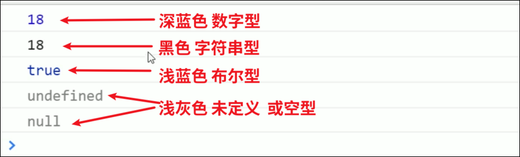

# 数据类型

JavaScript是一种弱类型或者说动态语言, 这意味着不用提前声明变量的类型, 在程序运行过程中, 变量类型会被自动确定

```JavaScript
var age=10; //age时数字型
var name="tom"; //name是字符串
```

在代码运行时, 变量的数据类型由JS引擎根据右边变量值的数据类型来判断, 运行完毕后, 变量就确定了数据类型

JS拥有动态类型, 意味着相同的变量可用作不同的类型

```JavaScript
var x=10; 
x="tom"; 
```

# 数据类型的分类

* 简单数据类型又叫做基本数据类型， 或者叫值类型(number string boolean undefined null)

  * 值类型： 在存储时变量存储的是值本身， 因此叫做值类型
* 复杂数据类型又叫做引用类型(object) 对象

  * 在存储时变量中存储的仅仅是地址（引用）， 因此叫做引用数据类型
  * 通过new关键字创建的对象（系统对象， 自定义对象）， 如Object, Array, Date 等

# 检测数据类型 typeof

typeof 可以检测变量的数据类型

使用方法: typeof 变量 ;

```JavaScript
age = 19;
typeof age; //number

str = prompt("请输入");
typeof str; //string
```

注意

* prompt获取的数据类型是字符串型  
  prompt(info)

# Chrome控制台颜色判断数据类型



# 数据类型转换

## 转换成字符串型

### toString()

```JavaScript
            age=10;
            age=age.toString()
            console.log(age);
            console.log(typeof age);
```

### String()

```JavaScript
            age=10;
            age=String(age);
            console.log(age);
            console.log(typeof age);
```

### +拼接字符串

```JavaScript
            age=10;
            age=age+"";
            console.log(age);
            console.log(typeof age);
```

注意

* toString() 和 String() 使用方法不一样
* 第三种方法更加常用, 我们称之为隐式转换

## 转换为数字型

### parseInt(string)函数

注意,:

* parseInt会丢弃小数部分及末尾的非数字部分

```JavaScript
            str="123.123a";
            str=parseInt(str);
            console.log(str);
            console.log(typeof str);
```

### parseFloat(string)函数

注意,:

* parseFloat会保留小数部分但是会丢弃末尾的非数字部分

```JavaScript
            str="123.123a";
            str=parseFloat(str);
            console.log(str);
            console.log(typeof str);
```

### Number(string)函数

注意:

* number函数会保留小数部分,但是如果末尾有了非数字, 那么会输出NaN

```JavaScript
            str="123.123a";
            str=Number(str);
            console.log(str); //NaN
            console.log(typeof str); //number
```

### js隐式转换 ( - / *)

通过- / * 运算可以转换字符串为数字型, 但是要求字符串没有非数字

```JavaScript
            str="123.123";
            str=str-0;
            console.log(str);
            console.log(typeof str);
```

## 转换为布尔型

Boolean()函数

* 代表空, 否定的值会转换成false( 例如 "", 0 , NaN , null , undefined )
* 其余会被转换成true

# 

# 保留n位小数

‍

```powershell
toFixed(位数)
```
