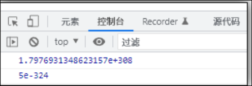
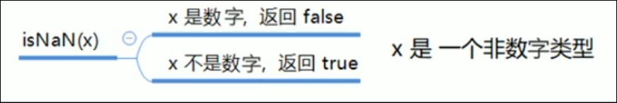

# 数字型 number

## 数字型 number

JS数字型既可以用来保存整数型, 也可以保存浮点型

```JavaScript
var age = 12;
var age = 12.222;
```

### 数字型进制

八进制: 0开始

十六进制: 0x开始

```JavaScript
//八进制 
var x=017;
//十六进制
var x=0x123abc;
```

### 数字型的最大值和最小值

利用一下代码可以输出数字型的最大值和最小值

```JavaScript
console.log(Number.MAX_VALUE);
console.log(Number.MIN_VALUE);

```



### 数字型的三个特殊值

* infinity: 无穷大
* -infinity: 无穷小
* NaN: not a number, 代表非数字

### isNaN()方法

isNaN()可以用来判断一个变量是否是 非数字 , 返回true 或 false


