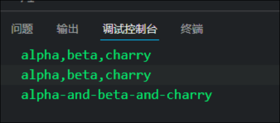

# 数组

数组是一组数据的集合,其中的每个数据被称为元素, 在数组中可以存放任意类型的元素, 数组是一种将一组数据存储在单个变量名下的优雅方式

```JavaScript
var arr=[1,2,3,4,5];
```

# 创建数组

创建数组有两种方式

* 利用new创建数组
* 利用数组字面量创建数组

### 利用new创建数组对象

```JavaScript
var arr = new Array(数组长度n); //创建一个新的空数组， 数组长度为n
var arr2 = new Array(元素1，元素2); //创建一个新数组， 内部有两个元素

```

### 利用数组字面量创建数组

```JavaScript
var arr = [1,2,3,4,5];
```

注意:

* 字面量创建数组使用中括号[ ]
* 数组的数据用逗号分隔
* 声明数组并赋值称为数组的初始化
* 字面量方式是最多使用的方式
* Array 注意大小写
* 数组里面的数据类型可以是任意类型

# 访问数组

## 数组的索引

索引( 下标 ): 用来访问数组元素的序号( 数组下标从0开始)

```JavaScript
var arr = [1,2,3,4,5]; 
var a = arr[2]; //a = 3;
```

数组可以通过索引来访问, 设置 , 修改对应的数组元素, 我们可以通过 数组名[下标] 来访问数组元素

越界访问会undefined

## 遍历数组

可以通过循环遍历数组

```JavaScript
        <script>
            var arr = [1, 2, 3, 4, 5];
            for (var i = 0; i <= arr.length; i++) {
                console.log(arr[i]);
            }
        </script>
```

## 数组长度

可以通过`.length`​可以访问数组的长度

```JavaScript
            var arr = [1, 2, 3, 4, 5];
            console.log(arr.length); //5
```

## 新增元素

* 可以通过修改`length`​长度及索引号增加数组元素
* 不要直接给数组名赋值, 会转换数据类型
* 未赋值的元素为`undefined`​

```JavaScript
            var arr = [1, 2, 3, 4, 5];
            console.log(arr.length);

            for (var i = 0; i < arr.length; i++) {
                console.log(arr[i]);
            }
            arr[9]=10; //修改索引号
            arr.length=10; //修改数组长度
            console.log(arr.length);

            for (var i = 0; i < arr.length; i++) {
                console.log(arr[i]);
            }
```

#### 通过修改length长度新增数组元素

* 可以通过修改`length`​长度来达到数组扩容的目的
* ​`length`​属性是可读写的
* 注意: 

  * 可以通过将数组`length`​设为0来清空数组, `arr[0]`​为`undefined`​

#### 通过修改索引号增加数组元素

* 可以通过修改数组下标的方式追加数组元素

# 检测是否为数组

# 添加或删除数组元素

# 查找数组元素

# 数组转换为字符串[^1]

# concat连接数组

# slice 截取数组

# splice 删除数组内部元素

[^1]: # 数组转换为字符串

    ## toString()

    直接把数组转换为字符串, 没有参数, 以逗号分隔

    ## join("分隔符")

    * 如果没有参数, 默认为逗号
    * 如果想没有分隔符,可以使用`join("")`

    没有参数时以逗号分隔, 可以传入参数作为自定义分隔符

    ```JavaScript
                var arr=["alpha", "beta", "charry"];
                console.log(arr.toString());
                console.log(arr.join());
                console.log(arr.join("-and-"));
    ```
    
