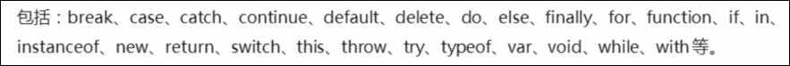
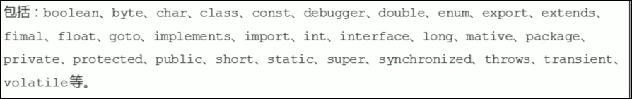

# 标识符 关键字 保留字

# 标识符

标识(zhi)符: 开发人员为变量, 属性, 函数, 参数取的名字

标识符不能是关键字或保留字

命名规范参见变量名(标识符)命名规范

# 关键字

关键字: js本身已经使用了的字, 不能再用他们充当变量名, 方法名

# 保留字

保留字 :保留字就是预留的关键字, 虽然现在还不是关键字, 但是未来可能成为关键字, 同样不能用他们来当变量名或方法名

