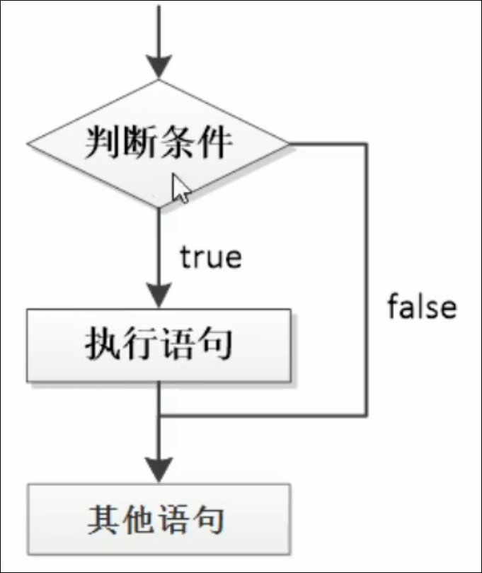
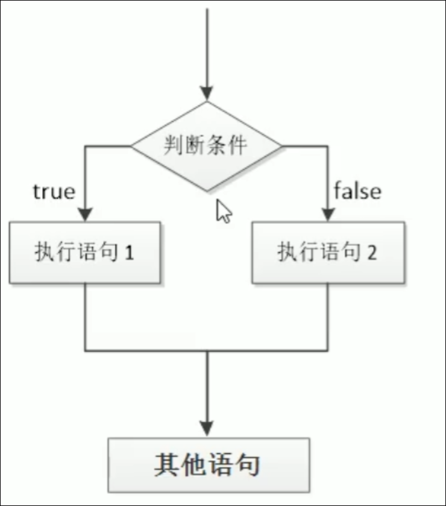
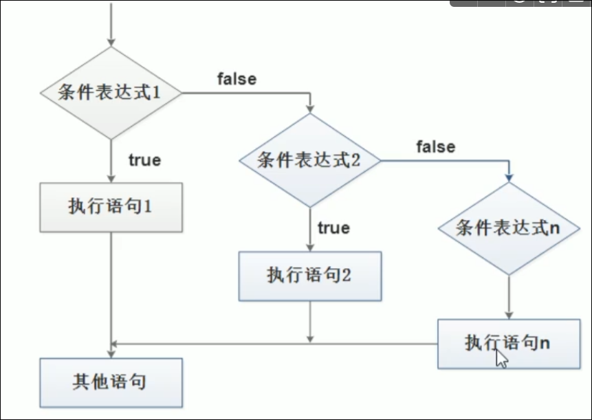

# if语句

# 语法结构

### if单分支语句

```JavaScript
if(条件表达式){
  //do something
}
```

执行流程: 如果条件表达式为真, 执行if里面的语句, 如果为假, 那么执行if后面的语句



### if else 双分支语句

```JavaScript
if(条件表达式){
  //do something 1
 }
 else {
  // do something 2
}

```

执行流程, 如果条件表达式为真, 那么执行语句1, 如果为假, 那么执行语句 2



‍

## if else if 多分支语句

```JavaScript
if(表达式1){
  //do something 1
}else if(表达式2){
  //do something 2
}else if{
...
}
```

执行过程: 先判断表达式1, 如果为真,那么执行语句1, 然后执行if后面的语句

如果为假, 判断表达式2 , .....

注意:

* if else if 最终只执行一个语句
* else if 里面的条件理论上可以有任意多个


