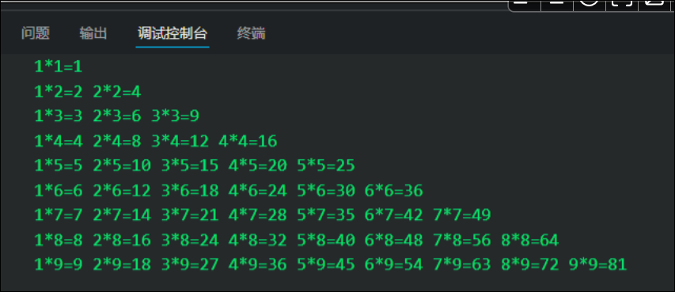

# for循环

# for循环

在程序中, 一组被重复执行的语句被称之为循环体, 能否继续重复执行, 取决于循环的终止条件, 由循环体及循环的终止条件组成的语句, 被称之为循环语句.

```JavaScript
for(初始化变量;条件表达式;操作表达式){
循环体
}
```

执行流程:

1. 执行初始化变量
2. 判断条件表达式, 如果为真
3. 执行循环体
4. 执行操作表达式
5. 判断条件表达式, 如果为假
6. 退出循环

注意:

* 初始化变量只执行一次
* 条件表达式最先执行, for循环体有可能一次也不执行
* 操作表达式最后执行

# 循环嵌套

很多情况下, 单层for循环并不能满足我们的要求, 比如要打印与各五行五列的图形, 打印一个倒三角形, 此时可以通过循环嵌套实现

循环嵌套是指在一个循环语句中再定义一个循环语句的语法结构

```JavaScript
        <script>
            str=""
            for (i = 1; i < 10; i++) {
                for (j = 1; j <= i; j++) {
                    // str+= j.toString()+"*"+i.toString()+"="+i*j+" "
                    str+= j+"*"+i+"="+i*j+" "
                }
                str+="\n"
            }
            console.log(str);
        </script>
```



注意:

* 外层的循环一次, 内层循环全部

# for in 循环

for in 循环用于对数组或对象的属性进行循环操作
