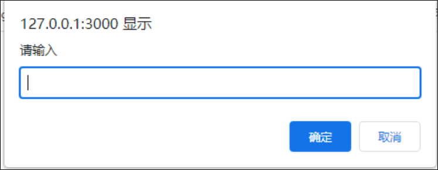
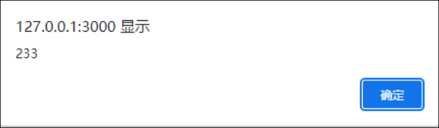
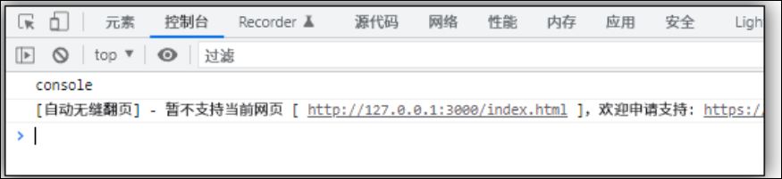
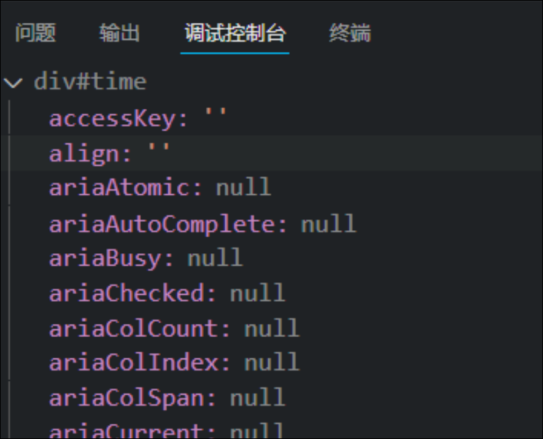
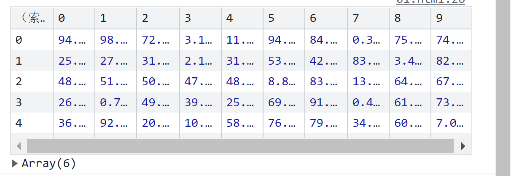

# 输入输出语句

# 输入

## prompt(info)

* 浏览器弹出输入框, 用户可以输入
* 第一个参数: 用户提示语
* 第二个参数: 输入框的默认值



# 输出

## alert(msg) :

浏览器弹出警示框



## console.log(msg)

开发者控制台打印输出



## console.dir(对象)

打印元素对象, 查看里面的属性和方法

```JavaScript
    <div id="time">2022/5/1 14:44</div>
    <script>
        var time = document.getElementById("time");
        console.dir(time);
    </script>
```



## 

## console.table(二维数组)

可以输出一个ui更加友好的二维数组


