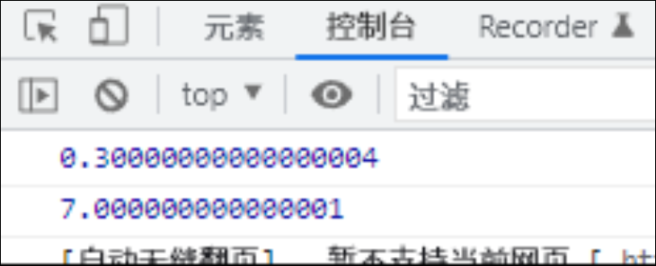

# 运算符

运算符( operater )也被称为操作符, 是实现用于赋值, 比较和执行算术运算等功能的符号

JS中常见的运算符有:

* 算术运算符
* 递增递减运算符
* 比较运算符
* 逻辑运算符
* 赋值运算符

# 浮点数的精度问题

尽量不要用浮点数直接参与运算, 浮点数值的最高精度为17位,但在进行算数运算时精度远远不如整数

```JavaScript
console.log(0.1+0.2);
console.log(0.07*100);

```



**不要直接比较两个浮点数** `0.1+0.2 ≠ 0.3`

# 表达式和返回值

* 表达式: 是由数字, 运算符, 变量等的组合
* 返回值

# 运算符优先级

||||
| --------| ------------| ------------------------|
|优先级|运算符|顺序|
|1|小括号|( )|
|2|一元运算符|++ — !|
|3|算术运算符|*/+-|
|4|关系运算符|> , > = , < , < =|
|5|相等运算符|== , ! = , === . ! = =|
|6|逻辑运算符|&&|
|7|赋值运算符|=|
|8|逗号运算符|,|

* 一元运算符的逻辑非优先级很高
* 逻辑与比逻辑或优先级高
