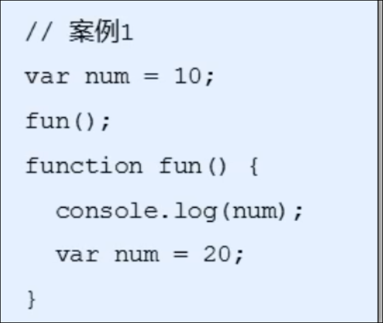
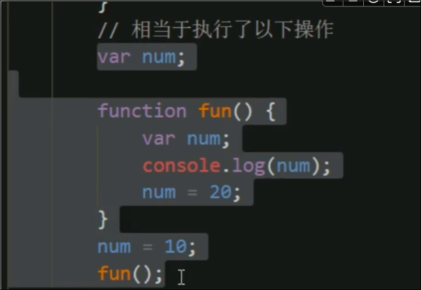
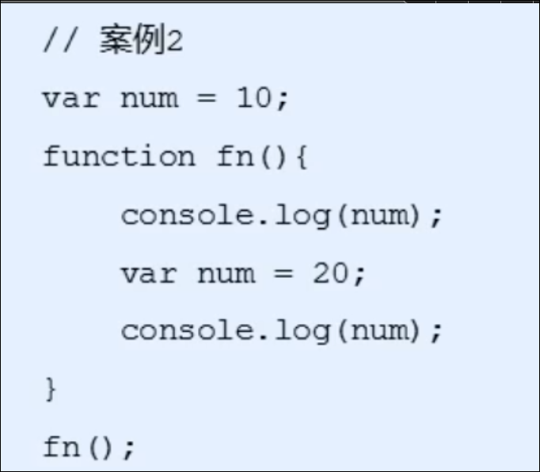
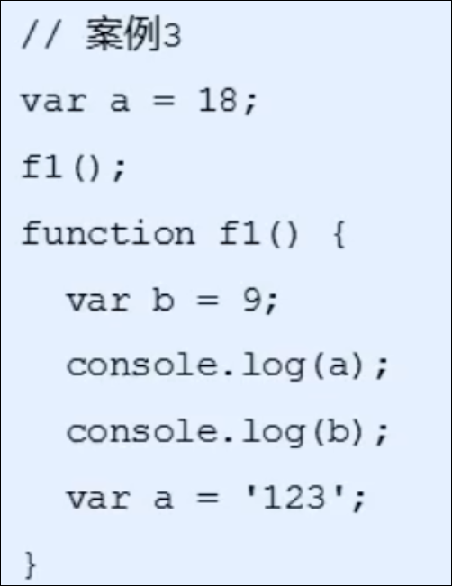
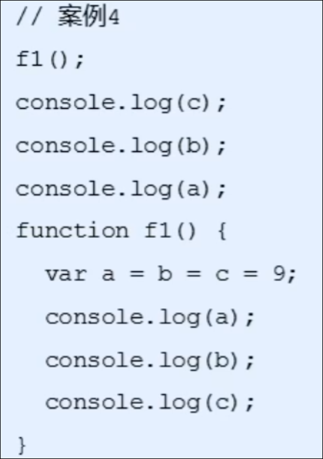

# 预解析

JS代码是由浏览器中的JS解释器来执行的, JS解释器在运行JS代码的时候分为两步:

预解析 和 代码执行

## JS代码执行过程

1. 预解析
2. 代码执行

### 预解析

JS引擎会把代码里面所有的var和function都提升到当前作用于的最前面,

预解析分为变量预解析 (变量提升 ) 和 函数预解析 ( 函数提升 )

#### 变量预解析

变量提升就是把所有的变量声明提升到当前作用域的最前面, 不提升赋值操作

#### 函数预解析

函数提升就是把所有的函数声明提升到当前作用域的最前面, 不调用

### 代码执行

按照代码书写的顺序逐行执行

## 案例

### 案例1

因为作用域链, 内层num没有赋值, 所以输出undefined

### 案例2

输出 undefined 20

### 案例3

输出 undefined 9

### 案例4

输出 9 9 9  9 9 报错

var a = b = c = 9;

相当于 var a=9; b=9; c=9;
