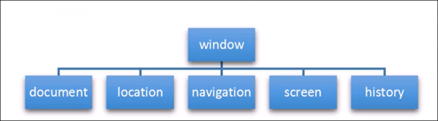

# BOM

# BOM简介

BOM(Broser Object Model)即浏览器对象模型, 它提供了独立于内容而与浏览器窗口进行交互的对象, 其核心对象是window

BOM由一系列相关的对象进行, 每个对象都提供了很多方法和属性

BOM缺乏标准, JavaScript语法的标准化组织是ECMA,DOM的标准化组织是W3C, BOM最初是netscape浏览器标准的一部分

DOM

* 文档对象模型
* DOM就是把文档当作一个对象来看待
* DOM的顶级对象是document
* DOM主要学习的是操作页面元素
* DOM是W3C标准规范

BOM

* 浏览器对象模型
* 把浏览器当作一个对象来看待
* BOM的顶级对象是window
* BOM学习的是浏览器窗口交互的一些对象
* BOM是浏览器厂商在各自浏览器上定义的, 兼容性较差

# BOM的组成

BOM比DOM更大, 它包括DOM

