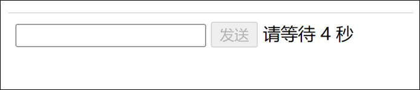

# 模拟发送短信, 点击按钮禁用一段时间



效果: 点击发送按钮之后按钮会禁用一段时间, 过一段时间之后按钮会重新启用

思路: 采用按钮的disable属性来控制启用与禁用, 先定义一个全局变量为等待时间. 给按钮绑定点击事件, 当点击开始时, 给按钮设置禁用, 同时启动定时器, 回调函数每执行一次就给等待时间减一, 假如等待时间小于0那么就清除定时器,把按钮启用, 把等待时间重新设置回去.

代码

```JavaScript
<!DOCTYPE html>
<html lang="en">
    <head>
        <meta charset="UTF-8" />
        <meta http-equiv="X-UA-Compatible" content="IE=edge" />
        <meta name="viewport" content="width=device-width, initial-scale=1.0" />
        <title>Document</title>
    </head>
    <body>
        <form action="">
            <input type="text" />
            <input type="button" value="发送" id="send_btn" />
            <label for="send_btn"></label>
        </form>
        <script>
            var btn = document.querySelector("#send_btn");
            var label = document.querySelector("label");
            var wait_time = 5;
            btn.addEventListener("click", function (e) {
                this.disabled = true;
                timer = setInterval(wait, 1000);
            });
            function wait() {
                wait_time--;
                console.log(wait_time);
                label.innerHTML = `请等待 ${wait_time} 秒`;
                if (wait_time <= 0) {
                    btn.disabled = false;
                    wait_time = 5;
                    label.innerHTML = "";
                    clearInterval(timer);
                }
            }
        </script>
    </body>
</html>

```
