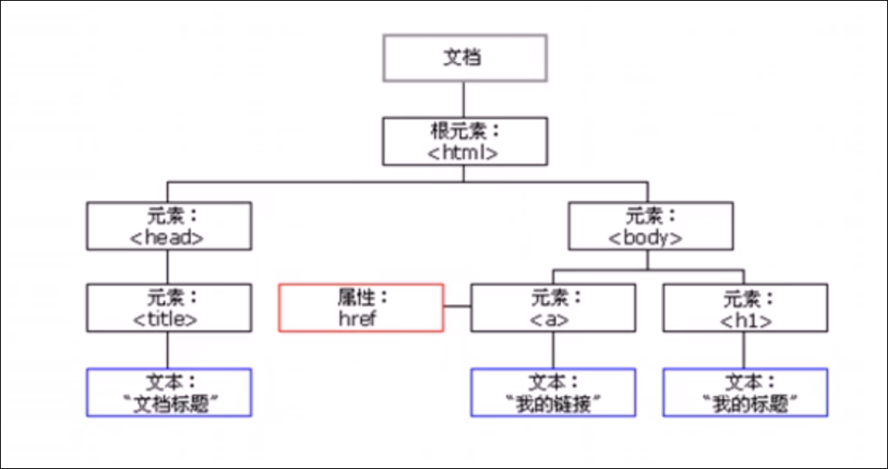

# DOM

# DOM简介

文档对象模型 (Document Object Model ,简称DOM ), 是w3c组织推荐的处理可拓展标记语言( HTML或XML ) 的标准编程接口

W3C已经定义了一系列的DOM接口, 通过这些DOM接口可以改变王爷的内容, 结构 和样式.

## DOM树

* 文档

  * 一个页面就是一个文档, DOM中用document来表示
* 元素

  * 页面中的所有标签都是元素, DOM中使用element来表示
* 节点

  * 网页中的所有内容都是节点( 标签, 属性 ,文本, 注释等), DOM中用node表示

**DOM把以上内容都看作对象**

# DOM重点核心

DOM操作,我们主要针对元素的操作, 主要有创建, 增, 删, 改, 查, 属性操作, 事件操作.

## 创建 新增节点

* document.white
* innerHTML
* creatElement

## 增 添加节点

* appendChild
* insertBefore

## 删 删除节点

* removeChild

## 改 操作元素

主要修改dom的元素属性, 元素的内容, 属性, 表单的值等

* 修改元素属性: src, href , title等
* 修改普通元素内容: innerHTML, innerText
* 修改表单元素: value , type, disable等
* 修改元素样式: style, className

## 查 获取元素

主要用来获取html的元素

* dom提供的api方法getElementById, getElementsByTagName等, 古老方法不推荐
* H5提倡的新方法 querySelector, querySelectorAll 推荐使用
* 利用节点操作获取元素 父parentNode; 子children; 兄previousElementSibling, nextElementSilbing 推荐

## 属性操作 自定义属性的操作

主要针对自定义属性

* setAttribute: 设置dom的属性值
* getAttribute: 获取dom的属性值
* removeAttribute: 移除dom的属性

## 事件操作 事件

给元素注册事件, 采用 `事件源.事件类型=事件处理程序`
