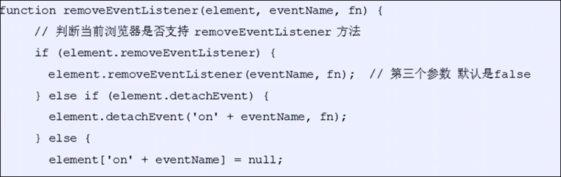

# 事件

事件是JS可以检测到的行为

简单理解: 触发—响应机制

网页中的每个元素都可以产生可以触发JS的事件, 例如. 我们可以在用户点击某个按钮的时候执行某些操作

# 事件三要素

事件由三部分组成:

* 事件源
* 事件类型
* 事件处理程序

## 事件源

事件源是事件被触发的对象, 例如按钮

## 事件类型

事件类型是事件如何触发, 比如鼠标点击.(onclick), 鼠标经过,或者键盘按下

## 事件处理程序

事件处理程序是通过一个函数赋值的方式完成

注意:

* 事件处理程序里面的this, 指向的是事件的调用者

# 注册事件(绑定事件)

给元素添加事件, 称为注册事件或绑定事件

注册事件有两种方式: 传统方式 和 方法监听注册方式

## 两种注册事件方法

### 1) 传统注册方式

* 利用on开头的事件 onclick :

  * `<button onclick="alert("hi")">button</button>`
  * `btn.onclick=function(){}`

特点 : (传统方式)注册事件的唯一性

* 利用传统方式注册事件 同一个元素的同一个事件只能注册一个处理函数, 最后注册的处理函数会覆盖前面的处理函数

### 2) 方法监听注册方式

* w3c标准推荐
* addEventLIstener() 他是一个方法
* IE9以前不支持, 可以使用attachEvent() 代替

特点 :

* 同一个元素同一个事件可以添加多个监听器,按照添加顺序依次执行

## 传统方法注册事件

`事件源.事件类型 = 事件处理程序`

1. 获取事件源
2. 注册事件( 绑定事件 )
3. 添加事件处理程序( 采用函数赋值形式 )

```JavaScript
        var btn = document.getElementById("btn");
        btn.onclick = function(){
            alert("you clicked the btn");
        }
```

## 方法监听注册方式 addEventListener

`eventTarget.addEventListener(type,listerner[,useCapture])`

`eventTarget.addEventListener`方法将指定的监听器注册到eventTarget(事件对象)上, 当事件对象触发相应的事件时, 就会执行事件处理函数

该方法有三个参数,第三个为可选

* type: 事件类型字符串, 如click, mouseover ; 注意这里没有on
* listener: 事件处理函数, 事件发生时, 会调用该监听函数 可以直接写函数, 也可以写函数名, 但是函数名不需要加括号
* useCapture: 可选值, 参数如果是true, 表示在事件捕获阶段调用事件处理程序; 如果是fakse( 默认就是false ), 表示在事件冒泡阶段调用事件处理程序事件流

注意:

* 事件监听方法可以注册多个事件处理函数
* 事件监听方法如果绑定了多个相同的函数, 那么只会生效一次
* 但是可以给多个元素绑定相同的事件处理函数

### 用于IE9之前的兼容性方式(只支持ie9之前)

`eventTarget.attachEvent(type,listner)`

* 这里的type带on

## 封装一个兼容性函数


# 删除事件(解绑事件)

## 删除事件的方式

### 传统方式

`eventTarget.onclick = null`

### 方法监听注册方式

* `eventTarget.removeEventListener(type, listener[,useCapture])`;

#### 用于IE9之前的兼容性方式(只支持ie9之前)

`eventTarget.detachEvent(type,listner)`

* 这里的type带on

### 封装一个兼容性函数



# 给某个元素绑定了事件之后, 可以通过元素名.事件名的方式执行事件处理函数

# 常见的鼠标事件

‍
