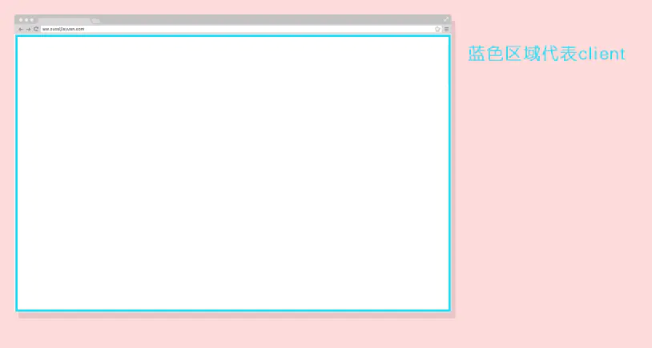
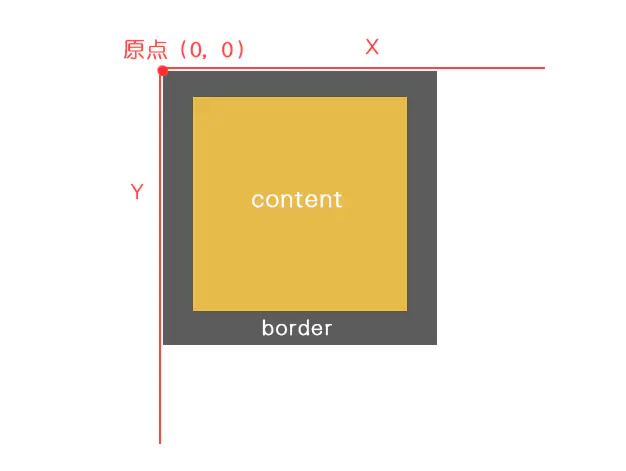

# 鼠标事件对象

|||
| -----------| -----------------------------------------|
|常用属性|说明|
|e.clientX|鼠标指针在点击元素（DOM）中的 X 坐标。|
|e.clientY|鼠标指针在点击元素（DOM）中的 Y 坐标。|
|e.offsetX|鼠标指针相对于目标节点内边位置的 X 坐标|
|e.offsetY|鼠标指针相对于目标节点内边位置的 Y 坐标|
|e.pageX|鼠标指针相对于整个文档的 X 坐标；|
|e.pageY|鼠标指针相对于整个文档的 Y 坐标；|
|e.screenX|鼠标指针相对于全局（屏幕）的 X 坐标；|
|e.screenY|鼠标指针相对于全局（屏幕）的 Y 坐标；|

client直译就是客户端，客户端的窗口就是指游览器的显示页面内容的窗口大小（不包含工具栏、导航栏等等）。

event.clientX、event.clientY就是用来获取鼠标距游览器显示窗口的长度。

​​

offset意为偏移量，是被点击的元素距左上角为参考原点的长度，而IE、FF和Chrome的参考点有所差异。

Chrome下，offsetX offsetY是包含边框的，如图所示。

​​
