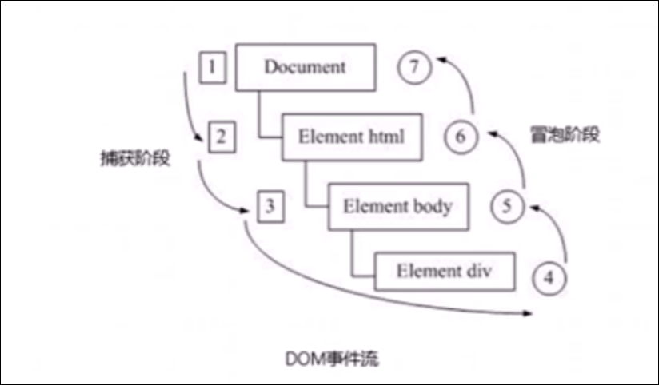
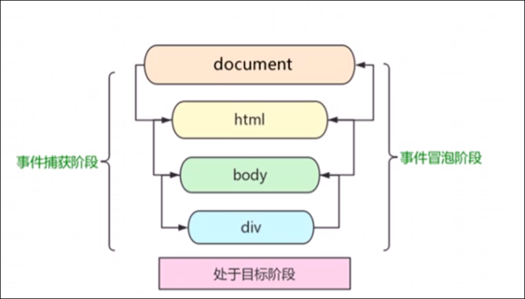

# 事件流

# DOM 事件流

事件流描述的是从页面中接收事件的顺序.

事件发生时会在元素节点之间按照特定的顺序传播, 这个传播过程就是DOM事件流



DOM事件流分为三个阶段

1. 捕获阶段
2. 当前目标阶段
3. 冒泡阶段

* 事件冒泡: IE 最早提出, 事件开始时由最具体的元素接受, 然后逐级向上传播到DOM最顶层节点的过程
* 事件捕获: 网景最早提出, 由DOM最顶层结点开始, 然后逐级向下传播到最具体的元素接受的过程



注意:

* JS代码只能执行捕获或冒泡其中的一个阶段
* onclick和attachEvent只能得到冒泡阶段
* addEventListener(type,listener[,useCapture])第三个参数如果是true, 表示在事件捕获阶段调用事件处理程序; 如果是fakse( 默认就是false ), 表示在事件冒泡阶段调用事件处理程序
* 实际开发中我们很少使用事件捕获
* 有些事件是没有冒泡的, 比如onblur, onfocus, onmouseenter, onmouseleave
* 事件冒泡有时会带来麻烦, 有时候又会帮助很巧妙的做某些事件, 后面学习

```JavaScript
<!DOCTYPE html>
<html lang="en">
    <head>
        <meta charset="UTF-8" />
        <meta http-equiv="X-UA-Compatible" content="IE=edge" />
        <meta name="viewport" content="width=device-width, initial-scale=1.0" />
        <title>事件流</title>
        <style>
            .father {
                width: 200px;
                height: 200px;
                background-color: aqua;
                margin: 200px auto;
            }
            .son {
                width: 100px;
                height: 100px;
                background-color: blueviolet;
                margin: 25px auto;
            }
        </style>
    </head>
    <body>
        <div class="father">
            1
            <div class="son">2</div>
        </div>
        <script>
            var father = document.querySelector(".father");
            var son = document.querySelector(".son");

            // js的事件流有两种: 事件捕获 和 事件冒泡
            // 事件捕获:
            /*      son.addEventListener("click", function () {
                alert("son");
            },true);
            father.addEventListener("click", function () {
                alert("father");
            },true); */

            // 第三个参数为true代表开启了事件捕获, 会从外向内的传递事件, 如果点击了son, 那么会先执行father的事件然后再执行son

            //冒泡捕获
            /*             son.addEventListener(
                "click",
                function () {
                    alert("son");
                }

            );
            father.addEventListener(
                "click",
                function () {
                    alert("father");
                }

            ); */

            //第三个参数没有填写或者填写了false的时候, 会开启事件冒泡, 会从内向外的传递事件, 所以先执行son的事件, 再执行father的事件, 尽管没有点击father

            son.onclick = function () {
                alert("son");
            };
            father.onclick = function () {
                alert("father");
            };


            //传统方式的绑定事件和attachEvent只有事件冒泡
        </script>
    </body>
</html>

```

* 事件捕获: 事件触发后, 由外向内的执行事件处理程序, 哪怕外部的没有触发也会执行
* 事件冒泡: 事件触发后, 由内向外的执行事件, 哪怕没有触发也会执行
