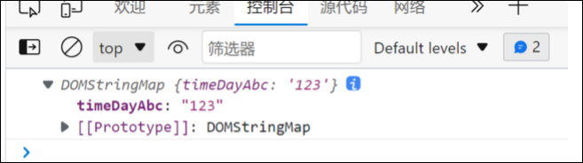

# 操作元素

JS的DOM操作可以改变网页内容, 结构和样式, 我们可以利用DOM操作元素来改变元素里面的内容, 属性等,. 注意一下都是属性

# 改变元素内容

## innerText

从起始位置到终止位置的内容, 会原样输出html标签, 也不会保留换行与空格

## innerHtml

起始位置到结束位置的全部内容, 会输出html标签, 也会保留空格和换行

注意:

* innerText和innerHtml属性都是可读写的.
* innerText是非标准的， innerHtml是W3C标准

# 常用元素的属性操作

* innerText
* innerHtml
* src
* href
* id
* alt
* tittle

# 表单元素的属性操作

利用DOM可以操作如下表单元素的属性：

`type， value， checked ， selected， disabled`

# 改变元素样式

我们可以通过JS修改元素的大小, 位置, 颜色

## 行内样式操作`element.style`

使用`element.style`可以给元素添加属性

```JavaScript
            div.style.backgroundColor="black";

```

注意:

* 使用style添加属性适用于属性数量较少的情况
* JS修改style属性操作, 产生的是行内样式, css权重比较高
* JS里面的样式采用驼峰命名法,比如fontSize, backgroundColor

## 类名样式操作`element.className`

使用`element.className`来修改元素的类名

首先定义一个要更改的类名 , 然后使用classname属性来改变元素的类名即可

```JavaScript
<style>
        .change{
            width: 200px;
            height: 200px;
            background-color: red;
            font-size: 24px;
            color: aqua;
        }
    </style>
  
    <body>
   <div class="box" id="div">
       怪
   </div>
   <script>
       var div = document.getElementById("div");
       div.onclick = function(){
           div.className="change";
           console.log("click");

       }

   </script>
</body>
```

注意:

* classname会直接修改元素的类名, 会覆盖原有的类名

## classList操作类名

可以通过classList快速的添加, 删除, 切换类名

### 添加类名classList.add("类名");

### 删除类名classList.remove("类名");

### 切换类名classList.toggle("类名");

如果有该类名, 会删除, 如果没有则会添加

‍

‍

# 自定义属性的操作

## 获取属性值的两种方法

* element.属性    获取属性值
* element.getAttribute("属性")；

区别：

* element.属性    获取元素的内置属性 （元素本身自带的属性）
* element.getAttribute()   一般用于获取自定义的属性

## 设置属性值

* element.属性=“值” 设置内置属性的值
* element.setAttribute("属性","值")；

区别：

* element.属性=“值” 设置内置属性的值
* element.setAttribute("属性","值")； 主要用来设置自定义的属性

## 移除属性

* removeAttribute("属性名")； 可以移除对应的属性

## H5自定义属性

自定义属性目的：是为了保存并使用数据， 有些数据可以保存到网页中而不用访问数据库

有时候很难判断属性是自定义属性还是内置属性

所以H5提供了自定义属性：

### H5设置自定义属性

H5规定自定义属性以data-开头

比如 `<div data-index="1">123</div>`

### H5获取自定义属性

* 传统方法 `element.getAttribute("data-index");`
* H5新增方法 `element.dataset.index` 或 `element.dataset["index"];`

注意：

* dataset为一个集合，里面存放了所有data开头的属性
* 如果自定义data属性含有多个`-`，如`<div data-time-day-abc="123"></div>`，那么dataset内部的会自动以小驼峰命名法命名



# 排他思想

如果由一组元素, 我们乡村给其中一个设置样式, 那么我们需要使用排他思想

1. 先清除其他元素的样式

    1. 然后给这个元素设置样式

‍
