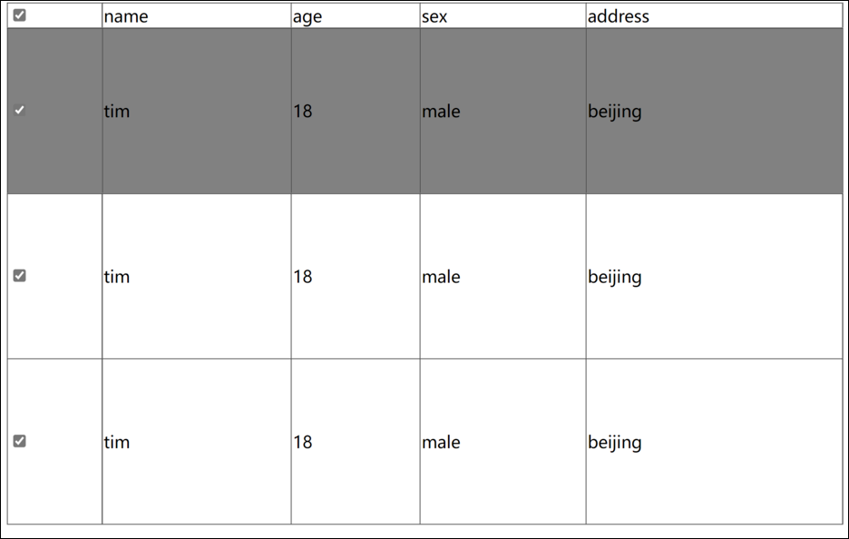

# 表格复选框控制全选

# 

效果：

* 如果点击表头的复选框， 那么每一行的都会跟随选中，
* 如果下面的每一行都选中了，那么总的复选框就会自动选中，如果有一个没有选中，那么总的复选框就不会选中

思路：

* 分为两个部分：总的复选框控制， 还有每一行的复选框控制

  * 总复选框控制： 设置一个点击事件，如果被选中就循环设置每行的复选框为选中或非选中
  * 每一行的控制： 给每一行的复选框设置一个点击事件， 每次点击就循环遍历每一行的复选框选中状态， 如果都为选中状态就改变总的复选框，如果有一个不是选中状态就取消总的选中状态

```JavaScript
<!DOCTYPE html>
<html lang="en">
    <head>
        <meta charset="UTF-8" />
        <meta http-equiv="X-UA-Compatible" content="IE=edge" />
        <meta name="viewport" content="width=device-width, initial-scale=1.0" />
        <title>Document</title>
        <style>
            table {
                border-collapse: collapse;
                width: 800px;
                height: 500px;
            }
        </style>
    </head>
    <body>
        <table border="">
            <thead>
                <tr>
                    <td><input type="checkbox" name="" id="chk_all" /></td>
                    <td>name</td>
                    <td>age</td>
                    <td>sex</td>
                    <td>address</td>
                </tr>
            </thead>
            <tbody>
                <tr>
                    <td><input type="checkbox" name="" id="chk" /></td>
                    <td>tim</td>
                    <td>18</td>
                    <td>male</td>
                    <td>beijing</td>
                </tr>
                <tr>
                    <td><input type="checkbox" name="" id="chk" /></td>
                    <td>tim</td>
                    <td>18</td>
                    <td>male</td>
                    <td>beijing</td>
                </tr>
                <tr>
                    <td><input type="checkbox" name="" id="chk" /></td>
                    <td>tim</td>
                    <td>18</td>
                    <td>male</td>
                    <td>beijing</td>
                </tr>
            </tbody>
        </table>

        <script>
            var trs = document.querySelector("tbody").querySelectorAll("tr");
            // 添加底色逻辑
            for (var i = 0; i < trs.length; i++) {
                trs[i].onmouseover = function () {
                    for (var j = 0; j < trs.length; j++) {
                        trs[j].style.backgroundColor = "";
                    }
                    this.style.backgroundColor = "gray";
                };
            }
            // 复选框逻辑
            var chk_all = document.querySelector("#chk_all");
            var chks = document.querySelectorAll("#chk");
            //总的复选框逻辑
            chk_all.onclick = function () {
                if (chk_all.checked == true) {
                    for (var i = 0; i < chks.length; i++) {
                        chks[i].checked = true;
                    }
                } else {
                    for (var i = 0; i < chks.length; i++) {
                        chks[i].checked = false;
                    }
                }
            };
            // 每一行的复选框逻辑
            for (var i = 0; i < chks.length; i++) {
                chks[i].onclick = function () {
                    var chk_flag = true;
                    // 计算有多少个选中的
                    for (var j = 0; j < chks.length; j++) {
                        if (chks[j].checked == false) {
                            chk_flag = false;
                            break;
                        }
                    }
                    if (chk_flag) {
                        //如果选中的和所有的行数相等, 就是全部选中了 那么更改全选的复选框
                        chk_all.checked = true;
                    } else {
                        chk_all.checked = false;
                    }
                };
            }
        </script>
    </body>
</html>

```
