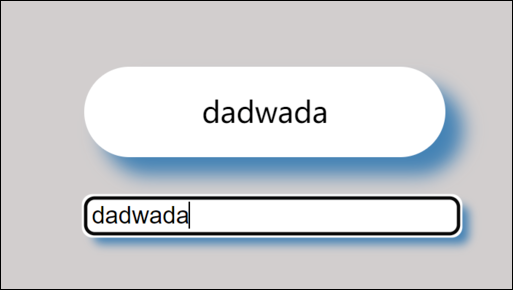

# 输入框提示



效果: 点击输入框输入内容后上方会出现提示, 如果失去焦点提示框会消失,点击输入框后会重新出现

思路: 给输入框绑定事件, 当`keyup`时, 先判断输入框是否有内容, 如果有内容, 就把输入框的内容给提示框, 如果没有, 就隐蔽提示框.

给输入框绑定`blur`和`focus`事件, 控制提示框的显示隐藏

代码:

```JavaScript
<!DOCTYPE html>
<html lang="en">
    <head>
        <meta charset="UTF-8" />
        <meta http-equiv="X-UA-Compatible" content="IE=edge" />
        <meta name="viewport" content="width=device-width, initial-scale=1.0" />
        <title>Document</title>
        <style>
            body {
                background-color: rgba(188, 182, 182, 0.673);
            }
            .search {
                width: 500px;
                margin: 200px auto;
            }
            .search .con {
                position: relative;
                box-sizing: border-box;
                width: 200px;
                height: 50px;
                margin-bottom: 20px;
                border-radius: 25px;
                background-color: #fff;
                box-shadow: steelblue 10px 10px 10px;
                text-align: center;
                line-height: 50px;
                visibility: hidden;
                /* overflow: hidden; */
            }
            .search .con::after {
                position: absolute;
                top: 100%;
                left: 50%;
                display: block;
                border: 20px solid;
                border-color: rgb(0, 140, 255) transparent transparent
                    transparent;
                content: "";
                transform: translate(-50%);
            }
            form input {
                width: 200px;
                border-radius: 5px;
                box-shadow: steelblue 5px 5px 5px;
            }
        </style>
    </head>
    <body>
        <div class="search">
            <div class="con">提示</div>
            <form action="">
                <input type="text" />
            </form>
        </div>

    <script>
            var con = document.querySelector(".con");
            var inp = document.querySelector("input");
            inp.addEventListener("keyup", function (e) { //按键时检测输入内容长度,实现赋值和显示隐藏
                if (this.value.length > 0) {
                    con.innerHTML = this.value;
                    con.style.visibility = "visible";
                } else {
                    con.style.visibility = "hidden";
                }
            });
            inp.addEventListener("blur", function (e) { //实现焦点控制显示隐藏
                con.style.visibility = "hidden";
            });
            inp.addEventListener("focus", function (e) {
                if (this.value.length > 0) {
                    con.style.visibility = "visible";
                }
            });
        </script>
    </body>
</html>

```
