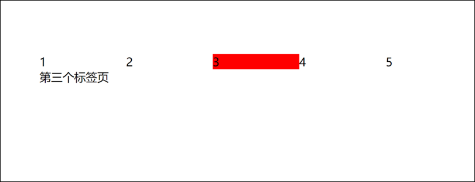

# 选项卡切换 tab栏



效果：

* 当点击相应的选项卡时，下方的内容区域进行对应的切换

思路

* 由两部分组成，上方的li和下方的内容区域

  * 内容区域设置了五个对应li的div，设置显示模式为none
  * 给li和div设置了current类，表示被选中

    * li被选中更改背景色
    * div被选中时设置显示模式为block
* 给每个li添加自定义属性，index

  * 给li绑定事件，当li被点击时，清除其他li和div的类，给被点击的li和div添加current类
  * div和li通过li的index属性相连

```JavaScript
<!DOCTYPE html>
<html lang="en">
    <head>
        <meta charset="UTF-8" />
        <meta http-equiv="X-UA-Compatible" content="IE=edge" />
        <meta name="viewport" content="width=device-width, initial-scale=1.0" />
        <title>tabSwitch</title>
        <style>
            * {
                margin: 0;
                padding: 0;
                list-style: none;
            }
            .tab {
                width: 600px;
                margin: 200px auto;
            }
            .tab .tab_nav {
                display: flex;
                justify-content: space-between;
            }
            .tab .tab_nav li {
                width: 100%;
                cursor: pointer;
            }
            .tab .tab_nav li.current {
                background-color: red;
            }

            .tab .tab_body div {
                display: none;
            }
            .tab .tab_body div.current {
                display: block;
            }
        </style>
    </head>
    <body>
        <div class="tab">
            <div class="tab_nav">
                <li class="current">1</li>
                <li>2</li>
                <li>3</li>
                <li>4</li>
                <li>5</li>
            </div>
            <div class="tab_body">
                <div class="current">第一个标签页</div>
                <div>第二个标签页</div>
                <div>第三个标签页</div>
                <div>第四个标签页</div>
                <div>第五个标签页</div>
            </div>
        </div>

        <script>
            var lis = document.querySelectorAll(".tab_nav li");
            var divs = document.querySelectorAll(".tab_body div");
            for (var i = 0; i < lis.length; i++) {
                //给li添加索引号
                lis[i].setAttribute("index", i);
                //给li的点击注册时间
                lis[i].onclick = function () {
                    for (var j = 0; j < lis.length; j++) {
                        //先清空所有的current
                        lis[j].className = "";
                        divs[j].className = "";
                    }
                    this.className = "current"; //给li和div设置current
                    divs[this.getAttribute("index")].className = "current";
                };
            }
        </script>
    </body>
</html>

```
