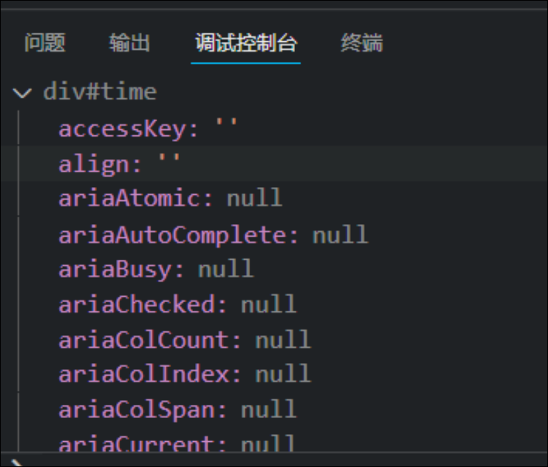
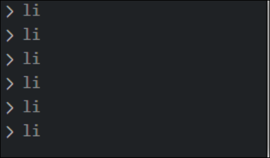
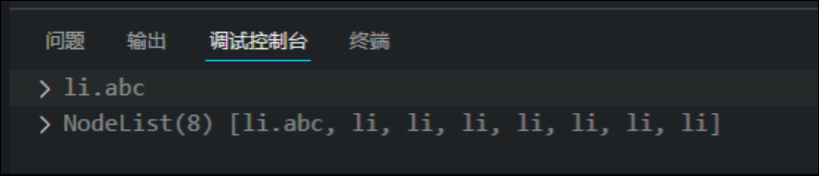
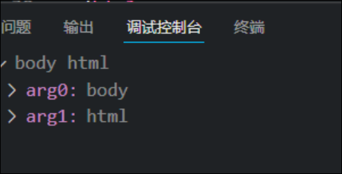

# 获取元素

DOM在实际开发中主要用来操作元素

获取页面的元素可以有以下方法

* 根据ID获取
* 根据标签名获取
* 通过HTML5新增的方法获取
* 特殊元素获取

因为要查找元素, 所以此时script标签也写在要找的标签的下面

## 通过ID获取 `getElementById`

使用`getElementById()`方法可以获取带有id的元素对象

### 参数

`getElementById()`的参数是大小写敏感的字符串

### 返回值

返回一个元素对象

```JavaScript
    <div id="time">2022/5/1 14:44</div>
    <script>
        var time = document.getElementById("time");
        console.dir(time);
    </script>
```



## 根据标签名获取`getElementsByTagName`

使用`getElementsByTagName()`方法可以返回带有指定标签名的对象的集合

### 参数

标签名的字符串

### 返回值

返回带有指定标签名的元素对象的集合, 以伪数组的形式存储

```JavaScript
            var lis = document.getElementsByTagName("li");
            for (var i = 0; i < lis.length; i++) {
                console.log(lis[i]);
            }
```



注意:

* 因为得到的是元素的集合, 所以想要操作里面的元素就要遍历
* 得到元素对象是动态的
* 如果只有一个符合要求的元素, 那么返回的还是数组
* 如果页面中没有这个元素, 那么返回一个空的伪数组

# HTML5新增的方法

## 通过类名获取元素`getElementsByClassName`

`document.getElementsByClassName()`

### 参数

字符串的类名

### 返回值

符合条件的指定元素集合

## 通过选择器选择第一个元素

`document.querySelector()`

### 参数

参考css的选择器

### 返回值

符合选择器条件的第一个元素

## 通过选择器选择所有符合条件的元素

`document.querySelectorAll ()`

### 参数

参考css的选择器

### 返回值

所有符合选择器条件的元素集合

```JavaScript
<div id="time">2022/5/1 14:44</div>
        <ul id="ul">
            <li class="abc">1</li>
            <li>2</li>
            <li>3</li>
            <li>4</li>
            <li>5</li>
        </ul>
        <li>123</li>
        <li>123</li>
        <li>123</li>
        <script>
            var a=document.querySelector(".abc")
            var b= document.querySelectorAll("li")
            console.log(a);
            console.log(b);
```

输出



# 获取body和html元素

使用`document.body`和`document.documentElement` 可以获取body和html元素

```JavaScript
            var bodyEle = document.body;
            var htmlELe = document.documentElement;
            console.log(bodyEle,htmlELe);
```



---

# 获取父元素内部的子元素

注意: 必须指定父元素, 不能用集合

```JavaScript
ul id="ul">
            <li>1</li>
            <li>2</li>
            <li>3</li>
            <li>4</li>
            <li>5</li>
        </ul>
        <li>123</li>
        <li>123</li>
        <li>123</li>
        <script>
            var ul = document.getElementById("ul")
            var lis = ul.getElementsByTagName("li");
            for (var i = 0; i < lis.length; i++) {
                console.log(lis[i]);
            }
```

# 打印元素对象的属性和方法

可以使用console.dir(对象)方法
