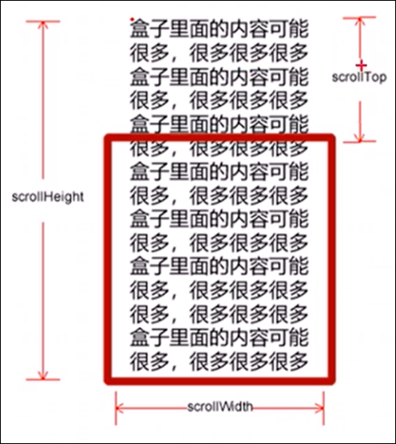
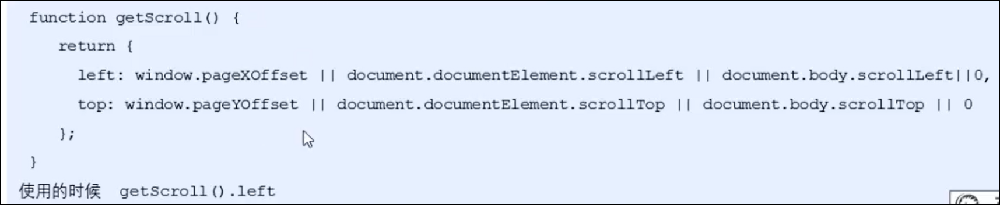

# 元素滚动scroll系列

scroll系列属性可以动态的获得元素的大小, 滚动距离等

|||
| ----------------| ------------------------------|
|scroll系列属性|说明|
|e.scrollTop|返回被卷去的上侧距离|
|e.scrollLeft|返回被卷去的左侧距离|
|e.scrollWidth|返回自身实际宽度, 不包括边框|
|e.scrollHeight|返回自身实际高度, 不包括边框|

注意:

* `scroll`属性都不带单位
* `scrollWidth/scrollHeight`返回的是元素内容区域的大小, 如果元素内容很多, 超出了盒子, 那么`scrollWidth/scrollHeight`也会显示实际的大小, 而`offset`和`client`不可以

# 滚动事件 scroll

# 获取页面被卷去的部分

可以使用`document.documentElement.scrollTop/Left ​`

或者 `window.scrollX/scrollY` 来获取页面被卷去的部分

页面被卷去的部分scrollX scrollY

`document.documentElement.scrollTop window.scrollY window.pageYOffset ​`三者等价

## 兼容性

声明了doctype : 使用`document.documentElement.scrollTop/Left ​`

如果没有声明doctype 使用`document.body.scrollTop/Left ​`

新方法: `scrollX, scroolY`

兼容性函数:

